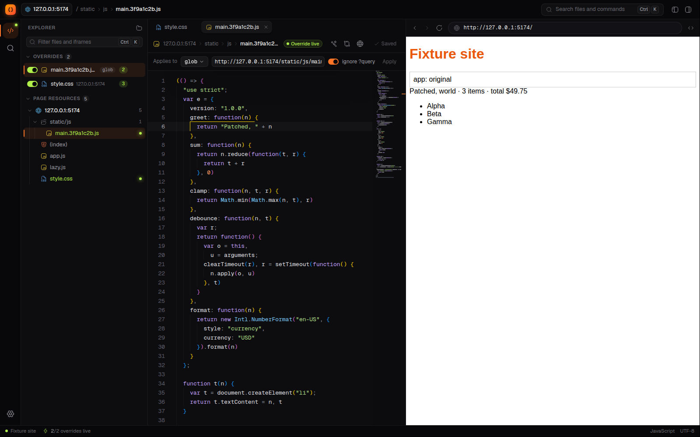

# Console Editor

**Edit the JavaScript, CSS and HTML of any live website — including code inside iframes — in a real code editor, and see it run on the page instantly. No build, no server access, no proxy certificates.**

Made for the moment when a service is too big to build locally but you need to debug or try a fix against the deployed site, and pasting code into the DevTools console is the only other option.



## How it works

The app embeds Chromium. When the page — or any iframe in it — requests a file you've edited, the app answers with your version instead of the server's, using the Chrome DevTools Protocol `Fetch` domain (the mechanism behind DevTools "Local Overrides"). Only the app's browser sees your changes; the server is untouched.

- **Pick files from the page.** Scripts, stylesheets and documents are listed as they load, grouped by origin, in a fast virtualized tree. Files loaded by iframes are marked.
- **Iframes, too.** Same-site, cross-site (out-of-process) and nested iframes are intercepted — each iframe's own session is set up before it's allowed to load anything.
- **A real editor.** Monaco (VS Code's editor) with syntax highlighting, find/replace, multi-cursor, and a diff view against where you started or against today's live file.
- **Minified bundles are pretty-printed** on open; huge files open in a fast highlight-only mode.
- **Ctrl/Cmd+S** saves the override and reloads the page. **Ctrl/Cmd+K** jumps to any file or command.
- **Survives deploys.** Match hashed names such as `main.*.js` with one click, and get a warning when the live file changed.
- **Handles what normally breaks this:** compressed responses, Subresource Integrity (static and runtime-set), HTTP cache, service workers, stale source maps, and Chromium's local-network checks on patched pages.
- **Overrides persist** and can be switched on and off individually.

Is this a good idea, and how does it compare to DevTools overrides, proxies and extensions? See **[docs/RESEARCH.md](docs/RESEARCH.md)**. Design and roadmap: **[docs/SPEC.md](docs/SPEC.md)**. The UI's tokens, motion and components: **[docs/DESIGN_SYSTEM.md](docs/DESIGN_SYSTEM.md)**.

## Quick start

```bash
npm install
npm run dev              # start the app with hot reload
```

Type a URL in the preview's address bar (`https://…` or `localhost:3000`), pick a file under **Page resources**, edit it, and press **Ctrl/Cmd+S**.

To try it on a site built to be awkward (gzip, SRI, hashed bundle names, cross-site and nested iframes), run `npm run demo-site` in a second terminal and open `http://127.0.0.1:5174` or `http://127.0.0.1:5174/frames.html`.

To open a URL on start: `CONSOLE_EDITOR_URL=https://example.com npm run dev`.

### Shortcuts

| Keys | Action |
|---|---|
| Ctrl/Cmd+S | Save override (and reload the page) |
| Ctrl/Cmd+K (or P) | Open a file or run a command |
| Shift+Alt+F | Pretty-print |
| Ctrl/Cmd+Shift+D | Toggle diff against the text you started from |
| Ctrl/Cmd+R | Reload the page |
| Ctrl/Cmd+L | Focus the address bar |
| Ctrl/Cmd+B | Show/hide the sidebar |
| Ctrl/Cmd+Shift+J | DevTools for the page |

## Development

| Command | What it does |
|---|---|
| `npm run dev` | Run the app with hot reload (electron-vite) |
| `npm run build` / `npm start` | Production build / run the build |
| `npm run typecheck` | TypeScript, main and renderer |
| `npm run lint:fsd` | Feature-Sliced Design architecture check ([Steiger](https://github.com/feature-sliced/steiger)) |
| `npm test` | Unit tests, plus integration tests of the interception engine (including iframes) in real Chromium — skipped if Chromium is missing: `npx playwright install chromium` |
| `npm run test:e2e` | Builds and drives the Electron app end to end (headless Linux: `xvfb-run npm run test:e2e`) |
| `npm run demo-site` | Serves the fixture site on port 5174 |

`CONSOLE_EDITOR_GALLERY=1 npm run dev` opens the design-system gallery instead of the editor.

### Architecture

- **Main process** (`src/main`): the interception engine (`engine/InterceptionEngine.ts`, one per CDP session) and its coordinator for iframes (`engine/PageInterception.ts`), the embedded page (`PageController.ts`), persistence and IPC.
- **Renderer** (`src/renderer/src`): React 19, organized with [Feature-Sliced Design](https://feature-sliced.design) — `app → pages → widgets → features → entities → shared`. State lives in small Zustand stores per entity; side effects live in features; a single bridge routes main-process events into the stores. The design system (`shared/ui`) uses Motion for animation and [Hugeicons](https://hugeicons.com) for icons, with several components adapted from [beUI](https://beui.dev) (MIT; see [THIRD_PARTY_NOTICES.md](THIRD_PARTY_NOTICES.md)).
- **Shared** (`src/shared`): IPC types and URL matching used by both.

When running as root on Linux (containers, CI), Electron needs its sandbox off: `npm run dev -- --noSandbox`.

## Limitations

- You edit the **built output** (bundled JS), not the original TypeScript/JSX. It's readable after pretty-printing, but identifiers stay minified.
- Changes exist only in the app's browser. The real fix still goes through your normal build and deploy.
- Workers aren't intercepted yet (roadmap M2).
- You log in to sites once inside the app; sessions are kept between runs.
