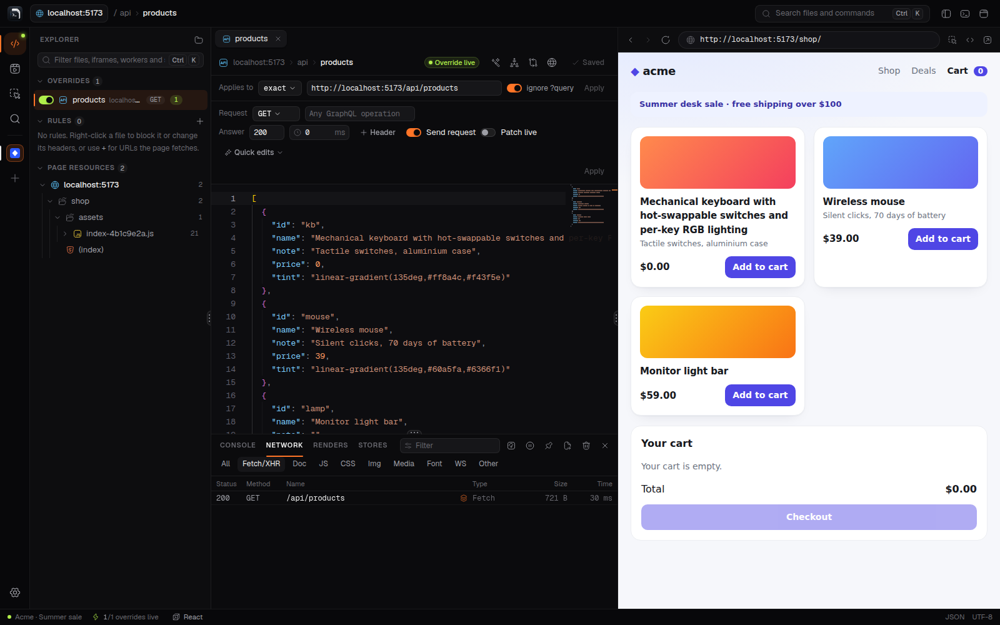
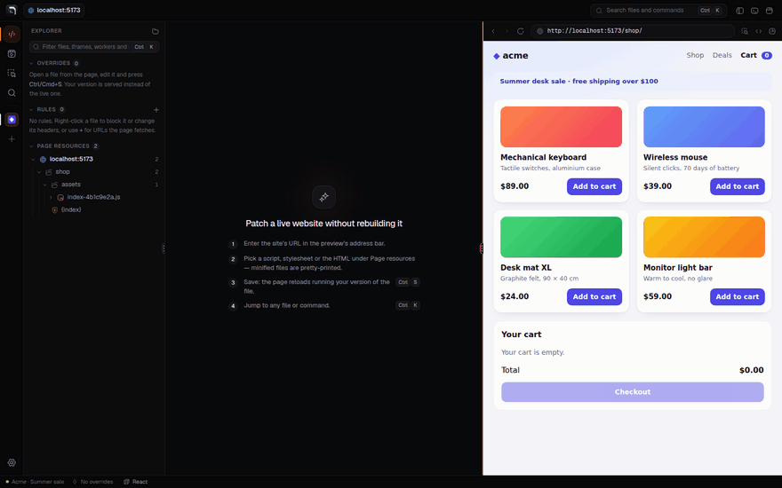
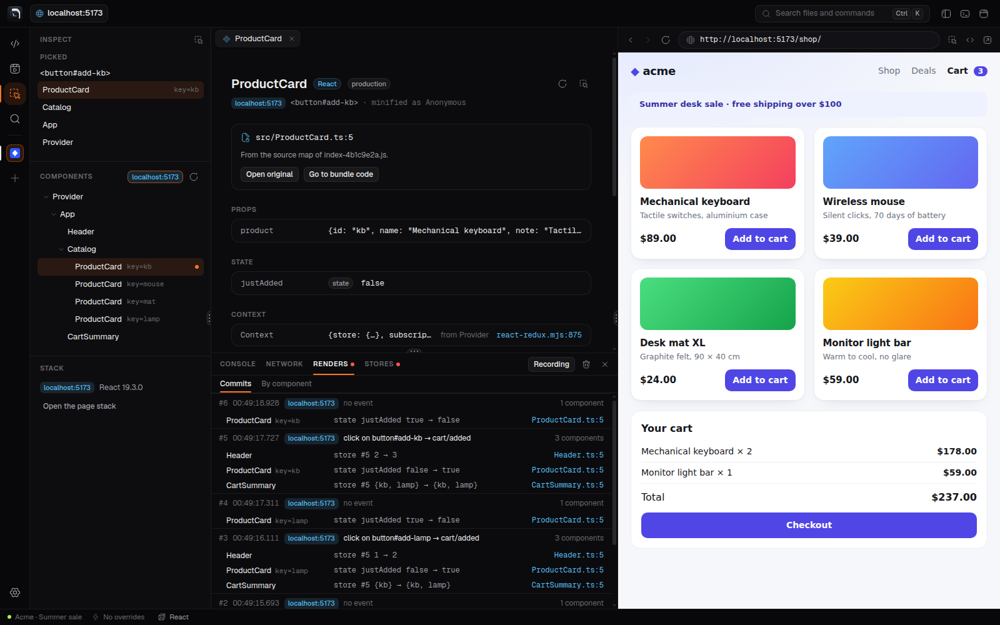
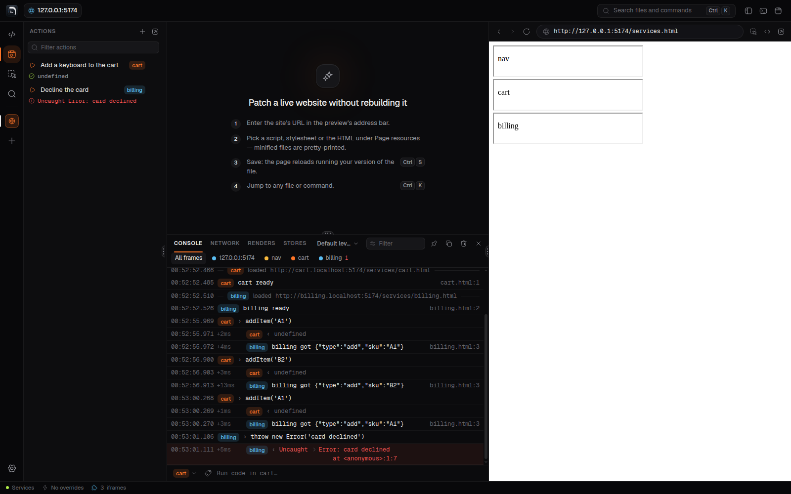

<div align="center">


# Console Editor

**Change, test and understand a live website in a real editor. No rebuild, no deploy.**

Open any site, pick a file it loaded, edit it and press <kbd>Ctrl</kbd>/<kbd>⌘</kbd> + <kbd>S</kbd>: the page reloads running your version.<br>
Swap its API responses, find the component behind any element, and see why it rendered. Nothing changes on the server.

[](https://github.com/olehwebdev/console-editor/releases/latest)
[](LICENSE)
[](https://www.electronjs.org/)
[](https://www.typescriptlang.org/)
[](https://react.dev/)
[](CONTRIBUTING.md)


<sub>The demo store's checkout shows <b>$NaN</b> because its bundle adds prices as strings. One edit, one save, and the live page shows <b>$138.00</b>.</sub>

</div>

---

## Use it when…

Console Editor is a browser with an editor built in. It serves the page your edits through the Chrome DevTools Protocol, so it works on any site you can open: staging, production, a teammate's preview, `localhost`.

| You want to… | Reach for |
|---|---|
| **Fix or try a change on a live site** when building the project takes an hour, or can't be done at all | [Overrides](#fix-a-live-site-without-a-rebuild): edit a script, stylesheet or HTML file and save |
| **See how the UI copes with other data**: an empty list, a long name, an error, a slow network | [The Network panel](#test-ui-states-against-real-api-data): override a response, pause a request, slow the page down |
| **Find which component and file render something** on a site you don't know, production builds included | [Pick an element](#find-the-component-behind-an-element): its component, source file, props, state and context |
| **Find out why the page updated**: which click, which store action, why each component rendered | [Renders and Stores](#see-why-it-rendered-and-what-the-store-did) |
| **Debug micro-frontends**: iframes from other sites that talk to each other | [One console for every frame](#debug-iframes-and-micro-frontends), and actions that run code in a frame with one click |
| **Get something out of the way**: an analytics script, a Content-Security-Policy, a CORS error | [Rules](#block-requests-and-change-headers) |

Each workspace keeps its own page, tabs, overrides, rules and actions, so a fix for one site or task never leaks into another.

## What you can do

### Fix a live site without a rebuild


- **Edit what the page actually loaded.** Scripts, stylesheets and HTML appear under **Page resources** as they load, grouped by origin, iframes and workers included. Minified bundles are pretty-printed when you open them.
- **Save to serve it.** <kbd>Ctrl</kbd>/<kbd>⌘</kbd> + <kbd>S</kbd> reloads the page with your version, before the page runs anything, on every load, until you switch the override off.
- **Survives deploys.** A hashed bundle name such as `main.3f9a1c2b.js` can be matched as `main.*.js` in one click, and you're warned when the live file changes under your override. **Diff** (<kbd>Ctrl</kbd>/<kbd>⌘</kbd> + <kbd>Shift</kbd> + <kbd>D</kbd>) shows what you changed.
- **Handles the hard cases:** compressed responses, Subresource Integrity (static and set at runtime), the HTTP cache, service workers and worklets, stale source maps.
- **Reads the original sources.** When the site publishes source maps, expand a bundle to open the TypeScript, JSX or SCSS it was built from, and jump between a line of it and the bundle code it became (<kbd>Ctrl</kbd>/<kbd>⌘</kbd> + <kbd>Shift</kbd> + <kbd>M</kbd>).

### Test UI states against real API data



- **Override a response.** The **Network** tab lists the requests of the page, its iframes and its workers. **Override response** opens one as formatted JSON (or as a tree you edit in place): empty a list, lengthen a name, drop a field, save, and the page gets your version. Match a GraphQL call by its operation, answer with another status, headers or a delay.
- **Never touch the server.** Turn off **Send request** and the server never sees the call, so a POST creates nothing. **Patch live** applies your edits to each live response instead of freezing it.
- **Quick edits** empty every list, lengthen every text or null a value in one click; the speed menu slows the page to 3G or takes it offline.
- **Pause a request.** A breakpoint stops a fetch or XHR before it goes out or before the page gets the answer: change it, send it, fail it with a network error, or keep your version as an override.
- WebSocket messages are listed as they come; a HAR file exports your requests or replays a teammate's session as overrides; **Copy as fetch** gives any request as a `fetch()` call.

### Find the component behind an element



- **Pick anything in the page** (<kbd>Ctrl</kbd>/<kbd>⌘</kbd> + <kbd>Shift</kbd> + <kbd>C</kbd>), in any frame, cross-site iframes included. The **Component** page shows the React, Vue (3 and 2), Angular or web component that rendered it: its file and line, props, state, the contexts it reads and who provides them, the element's handlers and listeners, and the components above it.
- **Production builds too.** Minified names and places are traced back through the site's source map (or one you load from a file), hooks are named after their variables, and **Open original** shows the source.
- **Set a value** of its state and see the page with it, then **Save as action** to set it again after a reload.
- **Browse the Components tree** of any frame, and read the **Page stack**: each frame's UI library, framework, state library and bundler, their versions and whether it's a production build.

### See why it rendered and what the store did

<table>
<tr>
<td width="50%" valign="top">

**Renders.** Record, use the page, and see every React commit: what triggered it (a click on `button#add-kb`, a store action) and why each component rendered, its props, state, a store, a context or its parent, or that a memo component was skipped. **By component** sums it up: how often each rendered and how long it took.



</td>
<td width="50%" valign="top">

**Stores.** Each action of the page's Redux, Redux Toolkit, NgRx, Zustand, Pinia or Vuex stores, with its payload, what it changed in the state (`cart.count 1 → 2`) and a link to the line of your code that dispatched it. **Sent by** in the Network panel shows the code that sent each request.


</td>
</tr>
</table>

### Debug iframes and micro-frontends



- **One console for every frame.** The logs of the page and every iframe, even from other sites, arrive in one list, each row tagged with its frame. Pick a frame and run code in it, and see how long the others took to react.
- **Actions** keep that code, such as an event sent to one service, to run again in its frame with one click. The Actions panel can move into a window of its own, kept on top of the page, and the website into one of its own, onto another screen.
- Overrides work in same-site, cross-site and nested iframes, and in what Web Workers, shared workers, service workers and worklets load.

### Block requests and change headers

Right-click a file to block it (an analytics script, a slow third-party iframe) before it reaches the server, or to remove a page's Content-Security-Policy, with an Undo. Rules can also set or remove any response header, or let the page call an API on another origin, preflights and cookies included. Each rule shows how often it applied and to which URLs.

### And

- **Never lose work.** Closing the app keeps unsaved edits as drafts and reopens your tabs and the last page; overrides switch on and off one by one.
- **Jump anywhere** with the command palette (<kbd>Ctrl</kbd>/<kbd>⌘</kbd> + <kbd>K</kbd>): every file the page loaded, your overrides, actions and commands.
- **Fast on big pages.** Multi-megabyte files open in a lighter mode, long lists are virtualized, and the inspector keeps up with apps of thousands of components.
- **Keeps the site contained.** A site gets no permissions silently, its pop-ups stay under the editor's control, and a "Leave site?" guard can't block a reload.
- **Keeps itself up to date**, with the release notes on a **What's New** page.

## Install

Download the installer for your system from the **[latest release](https://github.com/olehwebdev/console-editor/releases/latest)**:

| System | File |
|---|---|
| **macOS** | `…-mac-arm64.dmg` (Apple silicon) or `…-mac-x64.dmg` (Intel) |
| **Windows** | `…-win-x64-setup.exe`, or `…-win-arm64-setup.exe` on ARM |
| **Linux** | `.deb` (Ubuntu, Debian), `.rpm` (Fedora, openSUSE), `.AppImage` or `.tar.gz`, each for x64 and arm64 |

The builds aren't signed with a publisher certificate yet, so the first launch takes one extra step:

- **macOS:** drag the app to Applications and open it, then click **Open Anyway** in **System Settings › Privacy & Security**. If macOS calls the app damaged instead, run `xattr -dr com.apple.quarantine "/Applications/Console Editor.app"`. Each new version asks again, as do sites' camera, microphone and location permissions.
- **Windows:** if SmartScreen says it protected your PC, click **More info › Run anyway**. With Smart App Control on, Windows blocks unsigned apps with no way to allow just this one.
- **Linux:** on Ubuntu 24.04 and later, use the `.deb`: it installs the AppArmor profile Chromium's sandbox needs there. An AppImage needs `chmod +x` and the FUSE 2 library (`libfuse2`, or `libfuse2t64` on Ubuntu 24.04 and later; `fuse-libs` on Fedora). Once started, the AppImage (or the `.tar.gz`) adds itself to your applications with its icon, and keeps that launcher pointing at the new file after an update.

Each release lists SHA-256 checksums in `SHA256SUMS.txt`. Before a release is drafted, the disk images, the Windows installers and the `.deb` packages are each installed and tested on a machine of their architecture, and an installed Windows app and AppImage are updated to a newer build.

### Updates

Console Editor checks GitHub for a new release when it starts and every six hours, and tells you when there is one. **What's New** (in the Help menu) shows what changed; it also opens by itself after an update.

| Installed from | What happens |
|---|---|
| **Windows** installer, **AppImage** | **Download and install** downloads it in the background (only what changed, when it can); it installs on **Restart to update** or when you quit |
| **`.deb`**, **`.rpm`** | **Download and install** downloads it in the background; **Restart to update** asks for your password and installs it with the system's package manager (`dpkg`, and `apt-get` for new dependencies; `dnf`, `zypper`, `yum` or `rpm`). Quitting doesn't install it. The password prompt needs a polkit agent, as desktops have |
| **macOS** disk image | Downloads the new disk image, checks it against the release's SHA-256 checksums and opens it: drag the app into Applications. Installing in place needs builds signed with an Apple Developer ID, which these aren't yet |
| **`.tar.gz`** | Downloads the new archive to your Downloads folder, checked the same way, to unpack over this copy |

Downloads are verified before anything is installed (SHA-512 for automatic updates, SHA-256 for the others). Turn the checks off under **Settings › Check for updates**, and check any time from **Help › Check for Updates…**. Version 0.1.0 has no updater: install the next release by hand once.

## Get started

1. Type a URL in the preview's address bar (`https://…` or `localhost:3000`). Log in as you would in a browser; the session is kept.
2. Pick a file under **Page resources**, edit it and press <kbd>Ctrl</kbd>/<kbd>⌘</kbd> + <kbd>S</kbd>. Or open the **Network** tab in the bottom panel (<kbd>Ctrl</kbd>/<kbd>⌘</kbd> + <kbd>J</kbd>), or pick an element in the page (<kbd>Ctrl</kbd>/<kbd>⌘</kbd> + <kbd>Shift</kbd> + <kbd>C</kbd>).
3. Switch an override or rule off in the Explorer to get the live site back.

To open a URL on start, pass it to the app (`console-editor https://example.com` after installing the Linux package) or set `CONSOLE_EDITOR_URL`. On Linux and Windows, starting the app again with a URL opens it in the window that's already running.

<details>
<summary><b>Keyboard shortcuts</b></summary>

<br>

| Keys | Action |
|---|---|
| <kbd>Ctrl</kbd>/<kbd>⌘</kbd> + <kbd>S</kbd> | Save the override, or apply a rule (and reload the page) |
| <kbd>Ctrl</kbd>/<kbd>⌘</kbd> + <kbd>K</kbd> (or <kbd>P</kbd>) | Open a file or run a command |
| <kbd>Shift</kbd> + <kbd>Alt</kbd> + <kbd>F</kbd> | Pretty-print |
| <kbd>Ctrl</kbd>/<kbd>⌘</kbd> + <kbd>Shift</kbd> + <kbd>D</kbd> | Diff against the text you started from |
| <kbd>Ctrl</kbd>/<kbd>⌘</kbd> + <kbd>Shift</kbd> + <kbd>M</kbd> | Go to the original source, or back to the bundle code |
| <kbd>Ctrl</kbd>/<kbd>⌘</kbd> + <kbd>Shift</kbd> + <kbd>C</kbd> | Pick an element in the page to see its component |
| <kbd>Ctrl</kbd>/<kbd>⌘</kbd> + <kbd>R</kbd> | Reload the page |
| <kbd>Ctrl</kbd>/<kbd>⌘</kbd> + <kbd>L</kbd> | Focus the address bar |
| <kbd>Ctrl</kbd>/<kbd>⌘</kbd> + <kbd>B</kbd> | Show or hide the sidebar |
| <kbd>Ctrl</kbd>/<kbd>⌘</kbd> + <kbd>J</kbd> | Show or hide the bottom panel: console, network, renders and stores |
| <kbd>Ctrl</kbd>/<kbd>⌘</kbd> + <kbd>Shift</kbd> + <kbd>J</kbd> | DevTools for the page |
| <kbd>Ctrl</kbd>/<kbd>⌘</kbd> + <kbd>Alt</kbd> + <kbd>I</kbd> | DevTools for the editor itself |

Shortcuts also work while the page has focus, unless the page handles the same keys itself.

</details>

## How it works

The site runs in an embedded Chromium, and the editor talks to it through the **Chrome DevTools Protocol**, the channel DevTools uses. A file an override applies to is paused as its response arrives, its headers and cookies intact, and your version is served in its place; `integrity` attributes are dropped so the browser accepts it. Every cross-site iframe and every worker is its own target: the app attaches to each one and sets it up before it runs. The component inspector reads the page's own framework internals (React's fibers, Vue's instances, Angular's views) and traces each function to its source through the source map.

The details, including facts about Chromium verified in tests, are in **[docs/SPEC.md](docs/SPEC.md)**.

## How it compares

| | Edits served | Editor | Friction |
|---|---|---|---|
| **DevTools Local Overrides** | CDP, while DevTools is open | Sources panel | Exact URLs only (a new build hash breaks it); no SRI handling; loose files, no overview |
| **MITM proxy** (Charles, mitmproxy, Proxyman…) | A proxy for the whole machine | Your own, mapped by hand | Installing a root certificate; no list of what the page loaded |
| **Extensions** (Requestly, Resource Override…) | Redirects; rewriting needs the debugger API | Popup or panel | Manifest V3 limits; SRI still blocks edits |
| **React / Vue DevTools** | None: they change a component's state in memory, not the files | Their own panel | One framework each; a production build shows minified names |
| **Console Editor** | CDP, always, in its own browser | Monaco, with the page's file list, diff, source maps and a component inspector for React, Vue, Angular and web components | You log in to sites once inside the app (sessions persist) |

Is the idea sound? The trade-offs are in **[docs/RESEARCH.md](docs/RESEARCH.md)**.

## Your data

Everything stays on your machine: no telemetry, no uploads. Besides the sites you open (their icons, fetched from the site itself for the workspace rail, and the source maps of their files when you open the originals), the only requests the app makes on its own are the update check's: it asks GitHub for the latest release, and for that release's notes when it's new, sending nothing about you or your work. An update downloads only when you ask for it. **Settings › Check for updates** turns it off.

| | Where (under the app's data folder) |
|---|---|
| Overrides: your file, the text you started from, the match rule, on/off, and the workspace it belongs to | `workspace/` (<kbd>File › Reveal Overrides Folder</kbd>) |
| Rules: what each blocks or changes, its pattern, on/off, and its workspace | `workspace/rules.json` |
| Settings | `settings.json` |
| The last version run, to know when to show What's New | `update.json` |
| Workspaces: each one's name and tile, last page, open tabs, unsaved drafts and site icon | `session/` |
| The site's cookies, logins, storage | A persistent browser profile used only by the site view |

The data folder is `~/.config/Console Editor` on Linux, `~/Library/Application Support/Console Editor` on macOS and `%APPDATA%\Console Editor` on Windows. Uninstalling the app keeps it. Running from source uses a separate `Console Editor (dev)` folder next to it, so a dev build never touches your real data. Set `CONSOLE_EDITOR_USER_DATA` to use another folder.

## Limitations

- You edit the **built output** (bundled JS), not the original TypeScript or JSX. It's readable after pretty-printing, but identifiers stay minified. When the site publishes source maps with their sources, you can read the originals and jump between them and the bundle, but not edit them.
- Edits exist only in the app's browser. The real fix still goes through your normal build and deploy.
- The component inspector reads frameworks' internals, which production builds don't document: it's tested against React 19, Vue 3.5 and 2.7, and Angular 17 to 22. Renders are recorded for React only.
- A worker started by another worker runs its own first script unchanged: Chromium gives the app no way to change it (what that worker loads still gets your overrides). The app tells you when this happens.
- A service worker keeps the scripts it installed, so an edit to one takes effect when the app reloads the page: it unregisters the old worker and the page installs your version. That needs the page to register its service worker on every load, and the worker's push subscriptions are lost. After you restart the app, it doesn't know which of your edits a site's service worker installed: if the site has any script override (even one that's off, or for a file the worker doesn't load), the app's first reload with that worker running reinstalls it, and its push subscriptions are lost. Leaving the site and coming back doesn't do this.
- Chromium's update checks fetch a service worker's scripts where the app can't change them, and can put the live ones back: when the page calls `registration.update()`, whatever your settings, and with **Settings › Bypass service workers** off, after page loads too. The app tells you when it sees this, and its next reload puts your version back. With that setting off, what a service worker answers from its own cache isn't overridden, and a copy it cached while an override was on keeps your edit until the site caches it again. With it on, after you restart the app, a page reaches a service worker it installed earlier only from its second load (a Chromium quirk).
- Rules change only what the page sees: the browser's HTTP cache keeps the server's headers (**Settings › Disable HTTP cache**, on by default, skips it), cookies are stored before a rule runs, and a CSP set in a `<meta>` tag isn't a header (**Settings › Bypass Content-Security-Policy** covers it).
- A response override with **Send request** on (the default for a GET) answers after the server has: the request is still sent, so a POST would still create what it creates, which is why overrides made from anything but a GET start with it off. An event stream an override matches is replaced as a whole, which ends it.
- A paused request waits only as long as the page does: if the page gives up on it (a timeout, leaving the page), its tab closes with a note.
- WebSocket messages are shown, not changed: Chromium reports them but can't hold or edit them. A HAR import makes overrides for fetch and XHR responses only, not for documents or scripts.
- Chromium's local-network checks are off in the app's browser, so a patched localhost or intranet page can still reach its own servers. Browse only sites you're working on (see [SPEC §8](docs/SPEC.md#8-security)).

## Roadmap

What shipped, release by release, is in the **[CHANGELOG](CHANGELOG.md)**. Next:

- [ ] Parameters and scenarios for actions
- [ ] Edit in your own editor (watch the overrides folder), and export/import patch sets for teammates
- [ ] Search across every file the page loaded
- [ ] Drive your own Chrome over CDP
- [ ] Vue's renders and a data-flow view in the component inspector ([research](docs/INSPECTOR_RESEARCH.md))
- [ ] Signed and notarized builds (and with them, installing updates in place on macOS)

## Development

Requires [Node.js](https://nodejs.org/) 22.18 or newer.

```bash
git clone https://github.com/olehwebdev/console-editor.git
cd console-editor
npm install
npm run dev
```

**Try it on the demo site.** Run `npm run demo-site` in a second terminal and open:

| URL | What's there |
|---|---|
| `http://127.0.0.1:5174/store/` | The shop from the GIF: a checkout with a bug to fix |
| `http://127.0.0.1:5174/` | Files built to be awkward: gzip, SRI, a hashed bundle, source maps |
| `http://127.0.0.1:5174/frames.html` | Cross-site and nested iframes |
| `http://127.0.0.1:5174/services.html` | Services in iframes that log and message each other (try the console, and an action running `addItem('A1')` in `cart`) |
| `http://127.0.0.1:5174/workers/` | Dedicated, shared and service workers, and a worklet |
| `http://127.0.0.1:5174/maps.html` | Source maps named every way: a header, `X-SourceMap`, an inline map, a stylesheet's, a missing one, an HTML page instead |
| `http://127.0.0.1:5174/network/` | A page that talks to a JSON API, GraphQL and an event stream (open the Network tab and override the cart's response) |
| `http://127.0.0.1:5174/stack.html` | What Vue, Angular, Next.js and webpack leave in a page (the Page stack) |

| Command | What it does |
|---|---|
| `npm run dev` | Run the app with hot reload (`CONSOLE_EDITOR_URL=https://example.com npm run dev` opens a URL) |
| `npm run build` / `npm start` | Production build / run the build |
| `npm run typecheck` | TypeScript, main process and renderer |
| `npm run lint` | oxlint, type-aware: React's rules (hooks, refs, purity) and misused promises |
| `npm run lint:fsd` | [Feature-Sliced Design](https://feature-sliced.design) architecture check ([Steiger](https://github.com/feature-sliced/steiger)) |
| `npm run lint:structure` | Code-structure check: files of at most 150 lines, one function or component each, no `switch` ([CLAUDE.md › Code structure](CLAUDE.md#code-structure)) |
| `npm run lint:unused` / `lint:duplicates` / `lint:secrets` | No unused code (knip), no new copies (jscpd), no secrets in the tree (secretlint) |
| `npm test` | Unit and renderer tests, plus the interception engine, iframes, workers and the component inspector against real Chromium (skipped without it: `npx playwright install chromium`) |
| `npm run test:e2e` | Builds the app and drives it end to end with Playwright (headless Linux: `xvfb-run npm run test:e2e`) |
| `npm run test:perf` | The inspector and its UI on large apps (some 14,000 components, stores of 20,000 items), against time budgets |
| `npm run dist` | Builds the installers for your system into `dist/` (`npm run dist -- --dir` for just the app) |
| `npm run test:packaged` | Drives the packaged app end to end: pass the app's executable, or run it after `npm run dist` |
| `npm run test:update` | Updates an installed app (or an AppImage) to a newer build served locally: pass its executable and the newer build's `dist` folder |
| `npm run demo-site` | Serves the demo site on port 5174 |

- **Main process** (`src/main`): the interception engine (`engine/InterceptionEngine/`, one per CDP session) and its coordinator for iframe and worker sessions (`engine/PageInterception/`), the component inspector (`inspector/`), the embedded page, persistence and IPC.
- **Renderer** (`src/renderer/src`): React 19 organized with Feature-Sliced Design (`app → pages → widgets → features → entities → shared`), Zustand stores per entity, and a design system with Motion animations and [Hugeicons](https://hugeicons.com). Tokens, motion rules and components are in **[docs/DESIGN_SYSTEM.md](docs/DESIGN_SYSTEM.md)**; `CONSOLE_EDITOR_GALLERY=1 npm run dev` opens the component gallery.
- **Shared** (`src/shared`): IPC types, validation schemas and URL matching used by both.

When running as root on Linux (containers, CI), Electron needs its sandbox off: `npm run dev -- --noSandbox`.

## Contributing

Issues and pull requests are welcome. **[CONTRIBUTING.md](CONTRIBUTING.md)** explains how to set up, test and what a good PR looks like. Everyone taking part follows the [Code of Conduct](CODE_OF_CONDUCT.md). Found a security problem? Report it privately, as [SECURITY.md](SECURITY.md) explains, not in an issue.

## License

[MIT](LICENSE) © olehwebdev. Several UI components are adapted from [beUI](https://beui.dev) (MIT); see [THIRD_PARTY_NOTICES.md](THIRD_PARTY_NOTICES.md).

Built with [Electron](https://www.electronjs.org/), [Monaco Editor](https://microsoft.github.io/monaco-editor/), [React](https://react.dev/), [Zustand](https://zustand.docs.pmnd.rs/), [Motion](https://motion.dev/), [Tailwind CSS](https://tailwindcss.com/), [Hugeicons](https://hugeicons.com) and [js-beautify](https://beautifier.io/).
