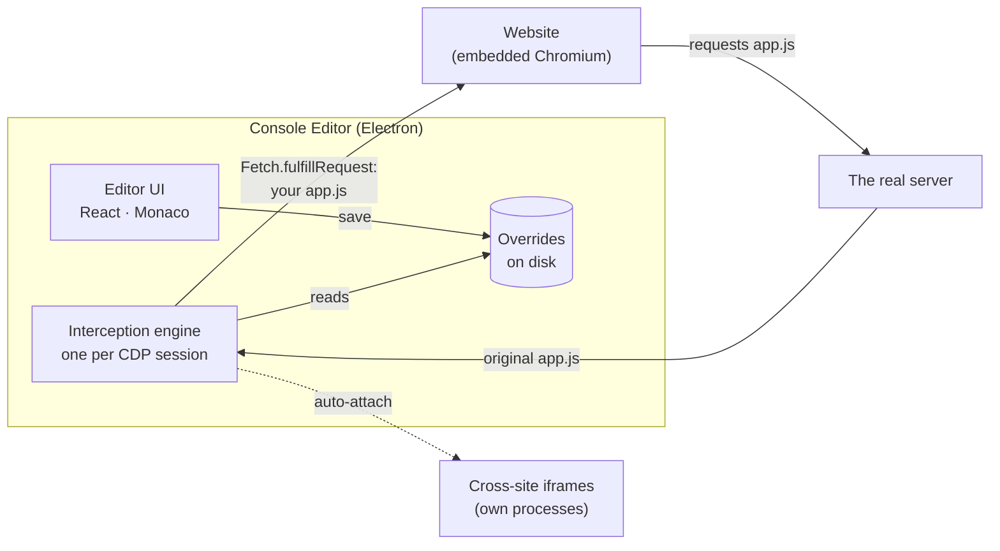

<div align="center">


# Console Editor

**Fix a live website's JavaScript, CSS and HTML in a real editor. No rebuild, no deploy.**

Open any site, pick a file it loaded, edit it in VS Code's editor and press <kbd>Ctrl</kbd>/<kbd>⌘</kbd> + <kbd>S</kbd>.<br>
The page reloads running your version. Nothing changes on the server; your edit lives only in the app.

[](LICENSE)
[](https://www.electronjs.org/)
[](https://www.typescriptlang.org/)
[](https://react.dev/)
[](CONTRIBUTING.md)


<sub>The demo store's checkout shows <b>$NaN</b>. Its bundle adds prices as strings. One edit, one save, and the live page shows <b>$138.00</b>.</sub>

</div>

---

## Why

You found a bug on staging (or production). The fix is one line, but building the service locally takes an hour, or can't be done at all. So you paste code into the DevTools console, lose it on every reload, and edit a minified bundle with no highlighting.

Console Editor makes that workflow first-class. It embeds a browser, intercepts the files the page loads through the Chrome DevTools Protocol, and serves your edited copy instead: before the page runs it, on every load, until you turn it off.

## Features

<table>
<tr>
<td width="50%" valign="top">

**Edit what the page actually loaded.** Scripts, stylesheets and HTML appear as they load, grouped by origin in a fast tree. Minified bundles are pretty-printed on open.


</td>
<td width="50%" valign="top">

**See exactly what you changed.** Diff your version against where you started, or against today's live file, to spot a redeploy.


</td>
</tr>
<tr>
<td width="50%" valign="top">

**Jump anywhere.** <kbd>Ctrl</kbd>/<kbd>⌘</kbd> + <kbd>K</kbd> fuzzy-searches every file the page loaded, your overrides and all actions.


</td>
<td width="50%" valign="top">

**Iframes too.** Same-site, cross-site (out-of-process) and nested iframes. Each iframe is set up before it is allowed to load anything.


</td>
</tr>
</table>

**And the details that usually break this approach:**

- **Survives deploys.** Hashed bundle names such as `main.3f9a1c2b.js` can be matched as `main.*.js` in one click, and you're warned when the live file changes under your override.
- **Handles the hard cases.** Compressed responses, Subresource Integrity (static and set at runtime), the HTTP cache, service workers, stale source maps, and Chromium's local-network checks on patched pages.
- **Never loses work.** Overrides persist and can be switched on and off one by one. Closing the app keeps unsaved edits as drafts and reopens your tabs and the last page next time.
- **Stays fast on big bundles.** Multi-megabyte files open in a lighter highlight-only mode, and the file tree is virtualized.
- **Keeps the site contained.** A site gets no permissions silently: camera, clipboard, location and similar ones prompt, the rest are denied. Its pop-ups stay under the editor's control, and a "Leave site?" guard can't block a reload.

## Quick start

Requires [Node.js](https://nodejs.org/) 22.18 or newer.

```bash
git clone https://github.com/olehwebdev/console-editor.git
cd console-editor
npm install
npm run dev
```

Type a URL in the preview's address bar (`https://…` or `localhost:3000`), pick a file under **Page resources**, edit it and press <kbd>Ctrl</kbd>/<kbd>⌘</kbd> + <kbd>S</kbd>.

**Try it on the demo site.** Run `npm run demo-site` in a second terminal and open:

| URL | What's there |
|---|---|
| `http://127.0.0.1:5174/store/` | The shop from the GIF: a checkout with a bug to fix |
| `http://127.0.0.1:5174/` | Files built to be awkward: gzip, SRI, a hashed bundle, source maps |
| `http://127.0.0.1:5174/frames.html` | Cross-site and nested iframes |

To open a URL on start: `CONSOLE_EDITOR_URL=https://example.com npm run dev`. Installers are on the [roadmap](#roadmap); for now the app runs from source. It is built on Electron for macOS, Windows and Linux, and has been tested on Linux so far.

<details>
<summary><b>Keyboard shortcuts</b></summary>

<br>

| Keys | Action |
|---|---|
| <kbd>Ctrl</kbd>/<kbd>⌘</kbd> + <kbd>S</kbd> | Save the override (and reload the page) |
| <kbd>Ctrl</kbd>/<kbd>⌘</kbd> + <kbd>K</kbd> (or <kbd>P</kbd>) | Open a file or run a command |
| <kbd>Shift</kbd> + <kbd>Alt</kbd> + <kbd>F</kbd> | Pretty-print |
| <kbd>Ctrl</kbd>/<kbd>⌘</kbd> + <kbd>Shift</kbd> + <kbd>D</kbd> | Diff against the text you started from |
| <kbd>Ctrl</kbd>/<kbd>⌘</kbd> + <kbd>R</kbd> | Reload the page |
| <kbd>Ctrl</kbd>/<kbd>⌘</kbd> + <kbd>L</kbd> | Focus the address bar |
| <kbd>Ctrl</kbd>/<kbd>⌘</kbd> + <kbd>B</kbd> | Show or hide the sidebar |
| <kbd>Ctrl</kbd>/<kbd>⌘</kbd> + <kbd>Shift</kbd> + <kbd>J</kbd> | DevTools for the page |
| <kbd>Ctrl</kbd>/<kbd>⌘</kbd> + <kbd>Alt</kbd> + <kbd>I</kbd> | DevTools for the editor itself |

Shortcuts also work while the page has focus, unless the page handles the same keys itself.

</details>

## How it works



1. The site runs in an embedded Chromium view; the editor talks to it through the **Chrome DevTools Protocol**, the same channel DevTools uses.
2. Requests an override applies to are paused at the **response** stage (`Fetch` domain). The real response arrives with its headers and cookies intact. Its body is hashed to detect redeploys, then replaced with your file.
3. Documents are rewritten to drop `integrity` attributes, and a small guard does the same for ones set at runtime, so the browser accepts edited scripts.
4. Every cross-site iframe is its own CDP target. The app auto-attaches to each one (and to theirs, recursively) and sets it up before the frame may load anything.

The details, including facts about Chromium verified in tests, are in **[docs/SPEC.md](docs/SPEC.md)**.

## How it compares

| | Edits served | Editor | Friction |
|---|---|---|---|
| **DevTools Local Overrides** | CDP, while DevTools is open | Sources panel | Exact URLs only (a new build hash breaks it); no SRI handling; loose files, no overview |
| **MITM proxy** (Charles, mitmproxy, Proxyman…) | A proxy for the whole machine | Your own, mapped by hand | Installing a root certificate; no list of what the page loaded |
| **Extensions** (Requestly, Resource Override…) | Redirects; rewriting needs the debugger API | Popup or panel | Manifest V3 limits; SRI still blocks edits |
| **Console Editor** | CDP, always, in its own browser | Monaco, with the page's file list, diff and pretty-print | You log in to sites once inside the app (sessions persist) |

Is the idea sound? The trade-offs are in **[docs/RESEARCH.md](docs/RESEARCH.md)**.

## Your data

Everything stays on your machine: no telemetry, no uploads.

| | Where (under the app's data folder) |
|---|---|
| Overrides: your file, the text you started from, the match rule, on/off | `workspace/` (<kbd>File › Reveal Overrides Folder</kbd>) |
| Settings | `settings.json` |
| Open tabs, unsaved drafts, last page | `session/` |
| The site's cookies, logins, storage | A persistent browser profile used only by the site view |

The data folder is `~/.config/Console Editor` on Linux, `~/Library/Application Support/Console Editor` on macOS and `%APPDATA%\Console Editor` on Windows. Set `CONSOLE_EDITOR_USER_DATA` to use another one.

## Limitations

- You edit the **built output** (bundled JS), not the original TypeScript or JSX. It's readable after pretty-printing, but identifiers stay minified.
- Edits exist only in the app's browser. The real fix still goes through your normal build and deploy.
- Workers aren't intercepted yet.
- Chromium's local-network checks are off in the app's browser, so a patched localhost or intranet page can still reach its own servers. Browse only sites you're working on (see [SPEC §8](docs/SPEC.md#8-security)).

## Roadmap

- [x] Overrides for scripts, stylesheets and HTML; SRI, gzip, hashed names, redeploy detection
- [x] Cross-site and nested iframes
- [x] Session restore with unsaved drafts
- [ ] Workers and service workers
- [ ] Edit in your own editor (watch the overrides folder), and export/import patch sets for teammates
- [ ] Response header overrides and request blocking
- [ ] Search across every file the page loaded
- [ ] Drive your own Chrome over CDP; installers for macOS, Windows and Linux
- [ ] Source-map explorer: open the original sources behind a bundle

## Development

| Command | What it does |
|---|---|
| `npm run dev` | Run the app with hot reload |
| `npm run build` / `npm start` | Production build / run the build |
| `npm run typecheck` | TypeScript, main process and renderer |
| `npm run lint:fsd` | [Feature-Sliced Design](https://feature-sliced.design) architecture check ([Steiger](https://github.com/feature-sliced/steiger)) |
| `npm test` | Unit and renderer tests, plus the interception engine and iframes against real Chromium (skipped without it: `npx playwright install chromium`) |
| `npm run test:e2e` | Builds the app and drives it end to end with Playwright (headless Linux: `xvfb-run npm run test:e2e`) |
| `npm run demo-site` | Serves the demo site on port 5174 |

- **Main process** (`src/main`): the interception engine (`engine/InterceptionEngine.ts`, one per CDP session) and its iframe coordinator (`engine/PageInterception.ts`), the embedded page, persistence and IPC.
- **Renderer** (`src/renderer/src`): React 19 organized with Feature-Sliced Design (`app → pages → widgets → features → entities → shared`), Zustand stores per entity, and a design system with Motion animations and [Hugeicons](https://hugeicons.com). Tokens, motion rules and components are in **[docs/DESIGN_SYSTEM.md](docs/DESIGN_SYSTEM.md)**; `CONSOLE_EDITOR_GALLERY=1 npm run dev` opens the component gallery.
- **Shared** (`src/shared`): IPC types and URL matching used by both.

When running as root on Linux (containers, CI), Electron needs its sandbox off: `npm run dev -- --noSandbox`.

## Contributing

Issues and pull requests are welcome. **[CONTRIBUTING.md](CONTRIBUTING.md)** explains how to set up, test and what a good PR looks like.

## License

[MIT](LICENSE) © olehwebdev. Several UI components are adapted from [beUI](https://beui.dev) (MIT); see [THIRD_PARTY_NOTICES.md](THIRD_PARTY_NOTICES.md).

Built with [Electron](https://www.electronjs.org/), [Monaco Editor](https://microsoft.github.io/monaco-editor/), [React](https://react.dev/), [Zustand](https://zustand.docs.pmnd.rs/), [Motion](https://motion.dev/), [Tailwind CSS](https://tailwindcss.com/), [Hugeicons](https://hugeicons.com) and [js-beautify](https://beautifier.io/).
