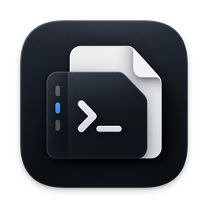
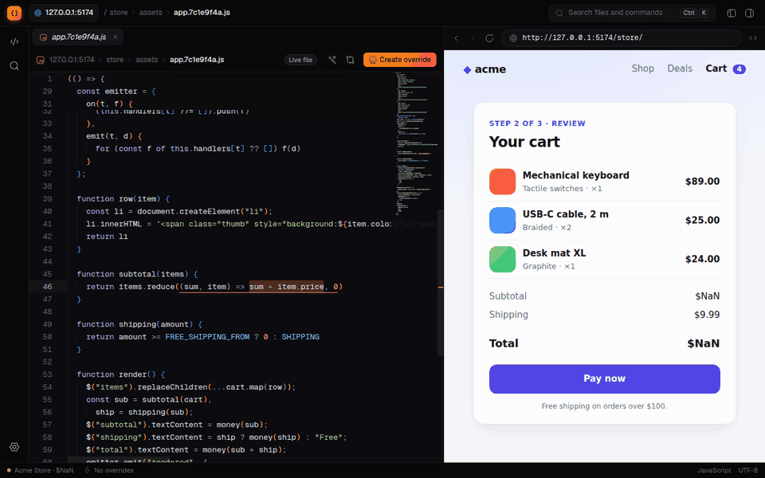
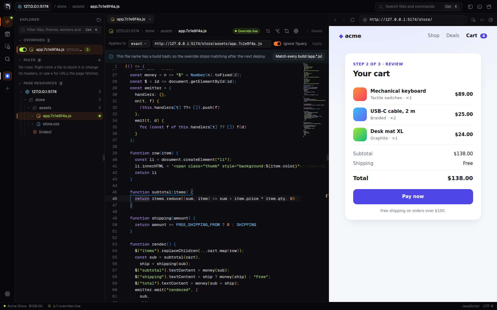
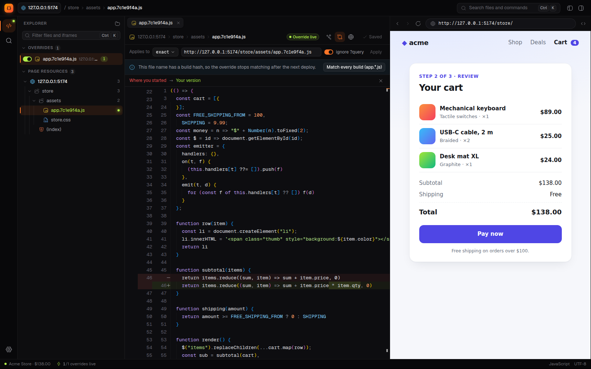
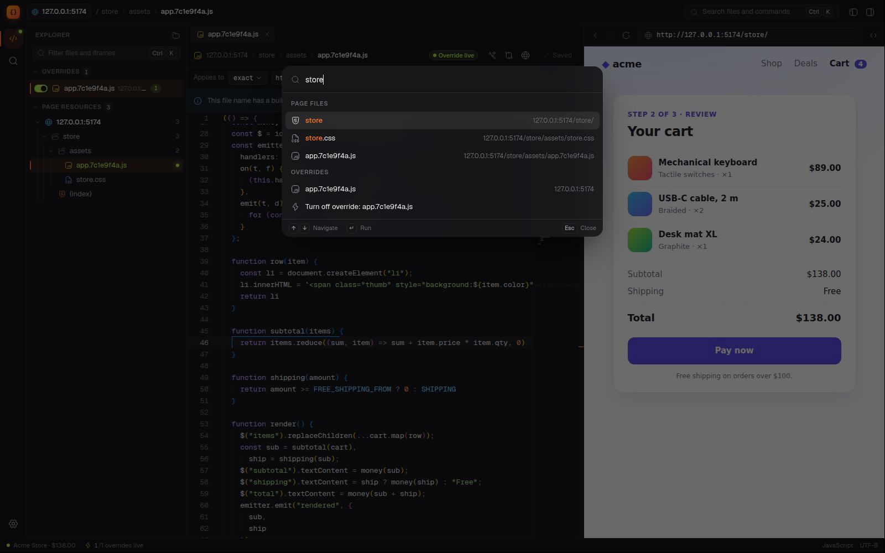
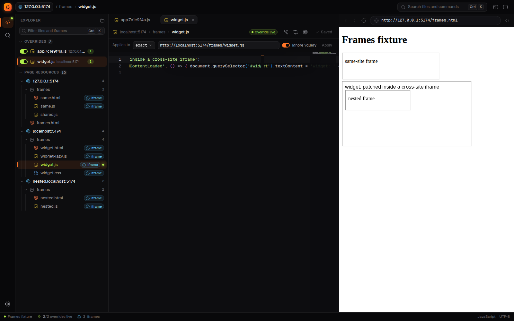
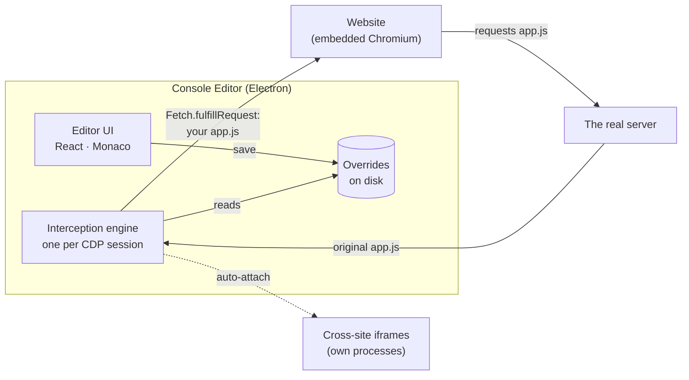

<div align="center">



# Console Editor

**Fix a live website's JavaScript, CSS and HTML in a real editor. No rebuild, no deploy.**

Open any site, pick a file it loaded, edit it in VS Code's editor and press <kbd>Ctrl</kbd>/<kbd>⌘</kbd> + <kbd>S</kbd>.<br>
The page reloads running your version. Nothing changes on the server; your edit lives only in the app.

[](https://github.com/olehwebdev/console-editor/releases/latest)
[](LICENSE)
[](https://www.electronjs.org/)
[](https://www.typescriptlang.org/)
[](https://react.dev/)
[](CONTRIBUTING.md)



<sub>The demo store's checkout shows <b>$NaN</b>. Its bundle adds prices as strings. One edit, one save, and the live page shows <b>$138.00</b>.</sub>

</div>

---

## Why

You found a bug on staging (or production). The fix is one line, but building the service locally takes an hour, or can't be done at all. So you paste code into the DevTools console, lose it on every reload, and edit a minified bundle with no highlighting.

Console Editor makes that workflow first-class. It embeds a browser, intercepts the files the page loads through the Chrome DevTools Protocol, and serves your edited copy instead: before the page runs it, on every load, until you turn it off.

## Features

<table>
<tr>
<td width="50%" valign="top">

**Edit what the page actually loaded.** Scripts, stylesheets and HTML appear as they load, grouped by origin in a fast tree. Minified bundles are pretty-printed on open.



</td>
<td width="50%" valign="top">

**See exactly what you changed.** Diff your version against where you started, or against today's live file, to spot a redeploy.



</td>
</tr>
<tr>
<td width="50%" valign="top">

**Jump anywhere.** <kbd>Ctrl</kbd>/<kbd>⌘</kbd> + <kbd>K</kbd> fuzzy-searches every file the page loaded, your overrides and all actions.



</td>
<td width="50%" valign="top">

**Iframes too.** Same-site, cross-site (out-of-process) and nested iframes. Each iframe is set up before it is allowed to load anything.



</td>
</tr>
</table>

**And the details that usually break this approach:**

- **Survives deploys.** Hashed bundle names such as `main.3f9a1c2b.js` can be matched as `main.*.js` in one click, and you're warned when the live file changes under your override.
- **Handles the hard cases.** Compressed responses, Subresource Integrity (static and set at runtime), the HTTP cache, service workers, stale source maps, and Chromium's local-network checks on patched pages.
- **Never loses work.** Overrides persist and can be switched on and off one by one. Closing the app keeps unsaved edits as drafts and reopens your tabs and the last page next time.
- **One workspace per task.** Keep a workspace for each site or fix you're working on, each with its own page, tabs, unsaved edits and overrides, and switch between them from the left rail. A tile shows the site's icon, or a letter on a colour you pick.
- **Stays fast on big bundles.** Multi-megabyte files open in a lighter highlight-only mode, and the file tree is virtualized.
- **Keeps the site contained.** A site gets no permissions silently: camera, clipboard, location and similar ones prompt, the rest are denied. Its pop-ups stay under the editor's control, and a "Leave site?" guard can't block a reload.
- **Keeps itself up to date.** A new release shows up as a notification with its notes on a **What's New** page, like VS Code's. On Windows and Linux (AppImage, `.deb`, `.rpm`) one click downloads it and **Restart to update** installs it (on Windows and with the AppImage, quitting does too), keeping your unsaved edits as drafts. On macOS and with the `.tar.gz` it downloads and checks the new version for you to install.

## Install

Download the installer for your system from the **[latest release](https://github.com/olehwebdev/console-editor/releases/latest)**:

| System | File |
|---|---|
| **macOS** | `…-mac-arm64.dmg` (Apple silicon) or `…-mac-x64.dmg` (Intel) |
| **Windows** | `…-win-x64-setup.exe`, or `…-win-arm64-setup.exe` on ARM |
| **Linux** | `.deb` (Ubuntu, Debian), `.rpm` (Fedora, openSUSE), `.AppImage` or `.tar.gz`, each for x64 and arm64 |

The builds aren't signed with a publisher certificate yet, so the first launch takes one extra step:

- **macOS:** drag the app to Applications and open it, then click **Open Anyway** in **System Settings › Privacy & Security**. If macOS calls the app damaged instead, run `xattr -dr com.apple.quarantine "/Applications/Console Editor.app"`. Each new version asks again, as do sites' camera, microphone and location permissions.
- **Windows:** if SmartScreen says it protected your PC, click **More info › Run anyway**. With Smart App Control on, Windows blocks unsigned apps with no way to allow just this one.
- **Linux:** on Ubuntu 24.04 and later, use the `.deb`: it installs the AppArmor profile Chromium's sandbox needs there. An AppImage needs `chmod +x` and the FUSE 2 library (`libfuse2`, or `libfuse2t64` on Ubuntu 24.04 and later; `fuse-libs` on Fedora).

Each release lists SHA-256 checksums in `SHA256SUMS.txt`. Before a release is drafted, the disk images, the Windows installers and the `.deb` packages are each installed and tested on a machine of their architecture, and an installed Windows app and AppImage are updated to a newer build.

### Updates

Console Editor checks GitHub for a new release when it starts and every six hours, and tells you when there is one. **What's New** (in the Help menu) shows what changed; it also opens by itself after an update.

| Installed from | What happens |
|---|---|
| **Windows** installer, **AppImage** | **Download and install** downloads it in the background (only what changed, when it can); it installs on **Restart to update** or when you quit |
| **`.deb`**, **`.rpm`** | **Download and install** downloads it in the background; **Restart to update** asks for your password and installs it with the system's package manager (`dpkg`, and `apt-get` for new dependencies; `dnf`, `zypper`, `yum` or `rpm`). Quitting doesn't install it. The password prompt needs a polkit agent, as desktops have |
| **macOS** disk image | Downloads the new disk image, checks it against the release's SHA-256 checksums and opens it: drag the app into Applications. Installing in place needs builds signed with an Apple Developer ID, which these aren't yet |
| **`.tar.gz`** | Downloads the new archive to your Downloads folder, checked the same way, to unpack over this copy |

Downloads are verified before anything is installed (SHA-512 for automatic updates, SHA-256 for the others). Turn the checks off under **Settings › Check for updates**, and check any time from **Help › Check for Updates…**. Version 0.1.0 has no updater: install the next release by hand once.

## Run from source

Requires [Node.js](https://nodejs.org/) 22.18 or newer.

```bash
git clone https://github.com/olehwebdev/console-editor.git
cd console-editor
npm install
npm run dev
```

Type a URL in the preview's address bar (`https://…` or `localhost:3000`), pick a file under **Page resources**, edit it and press <kbd>Ctrl</kbd>/<kbd>⌘</kbd> + <kbd>S</kbd>.

**Try it on the demo site.** Run `npm run demo-site` in a second terminal and open:

| URL | What's there |
|---|---|
| `http://127.0.0.1:5174/store/` | The shop from the GIF: a checkout with a bug to fix |
| `http://127.0.0.1:5174/` | Files built to be awkward: gzip, SRI, a hashed bundle, source maps |
| `http://127.0.0.1:5174/frames.html` | Cross-site and nested iframes |

To open a URL on start, pass it to the app (`console-editor https://example.com` after installing the Linux package) or set `CONSOLE_EDITOR_URL`: `CONSOLE_EDITOR_URL=https://example.com npm run dev`. On Linux and Windows, starting the app again with a URL opens it in the window that's already running.

<details>
<summary><b>Keyboard shortcuts</b></summary>

<br>

| Keys | Action |
|---|---|
| <kbd>Ctrl</kbd>/<kbd>⌘</kbd> + <kbd>S</kbd> | Save the override (and reload the page) |
| <kbd>Ctrl</kbd>/<kbd>⌘</kbd> + <kbd>K</kbd> (or <kbd>P</kbd>) | Open a file or run a command |
| <kbd>Shift</kbd> + <kbd>Alt</kbd> + <kbd>F</kbd> | Pretty-print |
| <kbd>Ctrl</kbd>/<kbd>⌘</kbd> + <kbd>Shift</kbd> + <kbd>D</kbd> | Diff against the text you started from |
| <kbd>Ctrl</kbd>/<kbd>⌘</kbd> + <kbd>R</kbd> | Reload the page |
| <kbd>Ctrl</kbd>/<kbd>⌘</kbd> + <kbd>L</kbd> | Focus the address bar |
| <kbd>Ctrl</kbd>/<kbd>⌘</kbd> + <kbd>B</kbd> | Show or hide the sidebar |
| <kbd>Ctrl</kbd>/<kbd>⌘</kbd> + <kbd>Shift</kbd> + <kbd>J</kbd> | DevTools for the page |
| <kbd>Ctrl</kbd>/<kbd>⌘</kbd> + <kbd>Alt</kbd> + <kbd>I</kbd> | DevTools for the editor itself |

Shortcuts also work while the page has focus, unless the page handles the same keys itself.

</details>

## How it works



1. The site runs in an embedded Chromium view; the editor talks to it through the **Chrome DevTools Protocol**, the same channel DevTools uses.
2. Requests an override applies to are paused at the **response** stage (`Fetch` domain). The real response arrives with its headers and cookies intact. Its body is hashed to detect redeploys, then replaced with your file.
3. Documents are rewritten to drop `integrity` attributes, and a small guard does the same for ones set at runtime, so the browser accepts edited scripts.
4. Every cross-site iframe is its own CDP target. The app auto-attaches to each one (and to theirs, recursively) and sets it up before the frame may load anything.

The details, including facts about Chromium verified in tests, are in **[docs/SPEC.md](docs/SPEC.md)**.

## How it compares

| | Edits served | Editor | Friction |
|---|---|---|---|
| **DevTools Local Overrides** | CDP, while DevTools is open | Sources panel | Exact URLs only (a new build hash breaks it); no SRI handling; loose files, no overview |
| **MITM proxy** (Charles, mitmproxy, Proxyman…) | A proxy for the whole machine | Your own, mapped by hand | Installing a root certificate; no list of what the page loaded |
| **Extensions** (Requestly, Resource Override…) | Redirects; rewriting needs the debugger API | Popup or panel | Manifest V3 limits; SRI still blocks edits |
| **Console Editor** | CDP, always, in its own browser | Monaco, with the page's file list, diff and pretty-print | You log in to sites once inside the app (sessions persist) |

Is the idea sound? The trade-offs are in **[docs/RESEARCH.md](docs/RESEARCH.md)**.

## Your data

Everything stays on your machine: no telemetry, no uploads. Besides the sites you open (and their icons, fetched from the site itself for the workspace rail), the only requests the app makes on its own are the update check's: it asks GitHub for the latest release, and for that release's notes when it's new, sending nothing about you or your work. An update downloads only when you ask for it. **Settings › Check for updates** turns it off.

| | Where (under the app's data folder) |
|---|---|
| Overrides: your file, the text you started from, the match rule, on/off, and the workspace it belongs to | `workspace/` (<kbd>File › Reveal Overrides Folder</kbd>) |
| Settings | `settings.json` |
| The last version run, to know when to show What's New | `update.json` |
| Workspaces: each one's name and tile, last page, open tabs, unsaved drafts and site icon | `session/` |
| The site's cookies, logins, storage | A persistent browser profile used only by the site view |

The data folder is `~/.config/Console Editor` on Linux, `~/Library/Application Support/Console Editor` on macOS and `%APPDATA%\Console Editor` on Windows. Uninstalling the app keeps it. Running from source uses a separate `Console Editor (dev)` folder next to it, so a dev build never touches your real data. Set `CONSOLE_EDITOR_USER_DATA` to use another folder.

## Limitations

- You edit the **built output** (bundled JS), not the original TypeScript or JSX. It's readable after pretty-printing, but identifiers stay minified.
- Edits exist only in the app's browser. The real fix still goes through your normal build and deploy.
- Workers aren't intercepted yet.
- Chromium's local-network checks are off in the app's browser, so a patched localhost or intranet page can still reach its own servers. Browse only sites you're working on (see [SPEC §8](docs/SPEC.md#8-security)).

## Roadmap

- [x] Overrides for scripts, stylesheets and HTML; SRI, gzip, hashed names, redeploy detection
- [x] Cross-site and nested iframes
- [x] Session restore with unsaved drafts
- [x] Workspaces: a page, tabs and overrides per site or task, switched from the rail
- [x] Installers for macOS, Windows and Linux
- [ ] Workers and service workers
- [ ] Edit in your own editor (watch the overrides folder), and export/import patch sets for teammates
- [ ] Response header overrides and request blocking
- [ ] Search across every file the page loaded
- [ ] Drive your own Chrome over CDP
- [x] Update notifications, What's New, and installing updates on Windows and with the AppImage, `.deb` and `.rpm`
- [ ] Signed and notarized builds (and with them, installing updates in place on macOS)
- [ ] Source-map explorer: open the original sources behind a bundle

## Development

| Command | What it does |
|---|---|
| `npm run dev` | Run the app with hot reload |
| `npm run build` / `npm start` | Production build / run the build |
| `npm run typecheck` | TypeScript, main process and renderer |
| `npm run lint:fsd` | [Feature-Sliced Design](https://feature-sliced.design) architecture check ([Steiger](https://github.com/feature-sliced/steiger)) |
| `npm test` | Unit and renderer tests, plus the interception engine and iframes against real Chromium (skipped without it: `npx playwright install chromium`) |
| `npm run test:e2e` | Builds the app and drives it end to end with Playwright (headless Linux: `xvfb-run npm run test:e2e`) |
| `npm run dist` | Builds the installers for your system into `dist/` (`npm run dist -- --dir` for just the app) |
| `npm run test:packaged` | Drives the packaged app end to end: pass the app's executable, or run it after `npm run dist` |
| `npm run test:update` | Updates an installed app (or an AppImage) to a newer build served locally: pass its executable and the newer build's `dist` folder |
| `npm run demo-site` | Serves the demo site on port 5174 |

- **Main process** (`src/main`): the interception engine (`engine/InterceptionEngine.ts`, one per CDP session) and its iframe coordinator (`engine/PageInterception.ts`), the embedded page, persistence and IPC.
- **Renderer** (`src/renderer/src`): React 19 organized with Feature-Sliced Design (`app → pages → widgets → features → entities → shared`), Zustand stores per entity, and a design system with Motion animations and [Hugeicons](https://hugeicons.com). Tokens, motion rules and components are in **[docs/DESIGN_SYSTEM.md](docs/DESIGN_SYSTEM.md)**; `CONSOLE_EDITOR_GALLERY=1 npm run dev` opens the component gallery.
- **Shared** (`src/shared`): IPC types and URL matching used by both.

When running as root on Linux (containers, CI), Electron needs its sandbox off: `npm run dev -- --noSandbox`.

## Contributing

Issues and pull requests are welcome. **[CONTRIBUTING.md](CONTRIBUTING.md)** explains how to set up, test and what a good PR looks like.

## License

[MIT](LICENSE) © olehwebdev. Several UI components are adapted from [beUI](https://beui.dev) (MIT); see [THIRD_PARTY_NOTICES.md](THIRD_PARTY_NOTICES.md).

Built with [Electron](https://www.electronjs.org/), [Monaco Editor](https://microsoft.github.io/monaco-editor/), [React](https://react.dev/), [Zustand](https://zustand.docs.pmnd.rs/), [Motion](https://motion.dev/), [Tailwind CSS](https://tailwindcss.com/), [Hugeicons](https://hugeicons.com) and [js-beautify](https://beautifier.io/).
