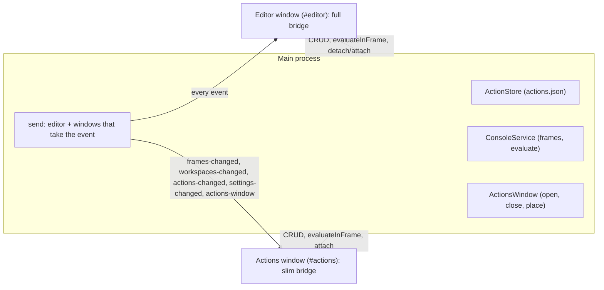

# Research: an Actions panel for sending events to frames

**Question.** On a micro-frontend page, you often poke one service from the console to watch another react: `window.top.frames['cart'].addItem('A1')`, a `postMessage`, a store dispatch. Retyping those calls is slow. Can the app keep them as named **actions** that you run with one click, in a panel you can also move into a window of its own (to another screen, next to the page)?

**Short answer.** Yes. The app can already run code in any frame of the page, including cross-site ones, so an action is saved code plus the frame it runs in. Two findings shape the design:

1. **Target the frame and don't go through `window.top.frames`.** From the top page, `frames['cart'].addItem()` throws a `SecurityError` whenever the frame is on another site, which is the usual case for micro-frontends. The console instead runs code inside the frame's own JavaScript context, where `addItem('A1')` just works. So an action stores *which frame* and *what to run there*.
2. **Detaching is multi-window work, and [#12](https://github.com/olehwebdev/console-editor/pull/12) already lays most of it down.** An HTML panel can't float over the website (the native page view is drawn above the DOM), so a detached panel has to be a real window. That PR adds the pieces a second window needs: views picked by location hash, a slim event bridge per window, IPC checks per sender, menu routing, and a store that remembers where the window was. The Actions window should reuse them.

---

## 1. What the app has today

| Piece | Where | What an Actions panel gets from it |
|---|---|---|
| Running code in a frame | `ConsoleService.evaluate` → `Runtime.evaluate` on the frame's session, in its main world, with `replMode`, `awaitPromise`, `userGesture` (SPEC §6.7) | Running an action is `api.evaluateInFrame(frameId, code)`. Its input and result already appear as console rows, and the call resolves with the result row (its preview, and a handle to expand it) |
| Frames | `listFrames` and `frames-changed` (`ConsoleFrame`: id, parent, url, `name` attribute, `canRun`) | The frames an action can target. There are none while **Record the console** is off, because the frames and their contexts come from `Runtime.enable` |
| Frame keys | `entities/frame/lib/frameKey`: `top`, else the frame's address without query or hash, else `name:<name>`, else `id:<id>` | A stable way to name a target across reloads, which the console's picker, frame names and colours already use |
| Frame names | `Workspace.frameNames`, per workspace, set with the console's "Name this frame" | Actions show the target by the name you gave it |
| Picking a target | `widgets/console-panel`: `FramePicker`, `resolveTarget` (the picked frame, else the first with its key) | The same picker and rule. `resolveTarget` moves down to `entities/frame` so a feature can use it |
| Prompt history | `features/run-in-frame`: localStorage, per workspace | A source for "Save as action" |
| Second windows (PR #12, merged since) | `app/model/views/` (`APP_VIEWS` by hash, each with its own `start` bridge), `loadEditor(win, hash)`, `registerIpc` with `fromEditor`/`fromPageUi` guards, `installMenu/editorCommand` (brings the editor forward), `PageWindowStore` + `placePageWindow` + `trackPlacement` | The Actions window is one more view, guard, store entry and menu item |

The roadmap already asks for this: SPEC §11 (M4) lists "sending a message to a frame without writing code … snippets and scenarios" under the console.

## 2. Verified

Probed in Chromium (`--site-per-process`) on the fixture's `services.html`, where `nav` is same-site and `cart` and `billing` are on sites of their own. `cart` defines `window.addItem(sku)`, which posts to the shell, which relays to `billing`, which logs it.

| Fact (verified) | Consequence |
|---|---|
| From the top page, `window.top.frames['cart'].addItem('A1')` throws `SecurityError: Blocked a frame … from accessing a cross-origin frame` | An action runs *in* its target frame (`addItem('A1')` with target `cart`), not in the top page through `frames[…]` |
| From the top page, `frames['nav'].document` works (same-site) | Code in the top page that reaches into same-site frames still works, so `top` stays a valid target for code written that way |
| From the top page, `frames['cart'].postMessage(data, '*')` works cross-site | A "send a message" action (§3.6) runs in the *parent* of the target, so the receiver sees the real parent as `event.source` and the parent's origin as `event.origin` |
| `addItem('A2')` evaluated in the cart frame's own context (its own CDP session, as the app's console does) runs, and billing logs `billing got {"type":"add","sku":"A2"}` | The existing `evaluateInFrame` path is all an action needs |
| CDP reports each frame's `name` attribute (`nav`, `cart`, `billing`) | Actions can fall back to the name `frames['cart']` uses when a frame's address changes |

## 3. Proposal

### 3.1 What an action is

```ts
interface ConsoleAction {
  id: string;          // 8 hex chars
  name: string;        // "Add A1 to cart"
  target: string;      // a frame key: 'top', 'http://cart.example.com/embed', 'name:cart'
  targetName: string;  // the frame's `name` attribute when it was picked ('' if none): the fallback below
  code: string;        // run in the target, as the console runs it: top-level await, $0, copy()
  createdAt: number; updatedAt: number;
}
```

**Which frame runs it:** the first frame whose key is `target`. If none has it, the first whose `name` is `targetName`, which covers a service whose path changed (`/v1/cart` → `/v2/cart`) but whose iframe is still `name="cart"`. If neither matches, or the frame can't run scripts, the action is shown as unavailable ("cart isn't on the page"), with **Pick frame** to point it at another.

### 3.2 Where actions are kept

In the main process, in `<userData>/workspace/actions.json` (`{ version: 1, actions: (ConsoleAction & { workspaceId })[] }`), through an `ActionStore` built like `OverrideStore`: written atomically, one write at a time.

- **Per workspace**, like overrides and frame names: frame keys are addresses on one site, so a site's actions mean nothing on another. Switching workspace sends `actions-changed` with the new workspace's list. Deleting a workspace deletes its actions, before the workspace itself, for the same reason its overrides go first (SPEC §5.1).
- **In main, not localStorage**, because two windows show them: every change goes through IPC and comes back to both windows as `actions-changed`, so the docked panel and the detached window never disagree.
- Not in `session.json`: that file is rewritten every time the tabs change, and actions change rarely.

### 3.3 Running an action

`features/action/run`: find the frame (§3.1), call `api.evaluateInFrame(frame.id, code)`, and keep the result per action id in a small store of its own.

- The console shows the action's code and its result like anything else you run, so the panel only has to summarise the outcome: a ✓ or ✕ and the result's preview text, with an expandable value (`getConsoleProperties` works from any window, since the handles live in main).
- Running an action doesn't add its code to the prompt's history. Runs don't queue: while an action is running, its button shows a spinner and ignores clicks.
- When **Record the console** is off there are no frames. The panel says so and offers **Turn it on**, as the console panel does.

### 3.4 The panel, docked

A third view on the activity rail: **Explorer, Actions, Settings** (`SidebarView` gains `'actions'`). The sidebar suits a vertical list, is already resizable, and leaves the console free to show the results. The bottom panel is short and wide, and would have to share its room with the rows.

- **List:** one row per action, showing its name, a frame chip for the target (colour and name as in the console) and a ▶ button. Clicking a row, or pressing Enter on it, runs the action; the result shows under it. You can filter the list by text.
- **New / edit:** a form with a name, a frame picker (the console's) and the code. Use a mono textarea like the console prompt for now: in a second window, Monaco would load its whole bundle and, on first use, the TypeScript service (about 125 MB, SPEC §12) for a few lines of code.
- **Save as action** on a console `input` row, and from the prompt ("Save what I typed"), with the code and the frame already filled in. Most actions will start life as code you just ran and saw work.
- **Command palette:** a "Run action" group (`Run: Add A1 to cart`).
- **Context menu:** Run, Edit, Duplicate, Delete (asks first), Copy code.

### 3.5 The panel in its own window

**Detach** in the panel's header (and **View › Actions in Their Own Window**, and the palette) moves the list into a window of its own. Closing that window brings the panel back into the sidebar. As with #12's website window, quitting keeps it detached and the next start reopens it where it was.



**Main process** (`src/main/ActionsWindow/`, next to #12's `PageWindow/`):
- `ActionsWindow` class: `open()` creates a `BrowserWindow` (same preload, `contextIsolation`, `sandbox`, the app's background colour; about 420×640, at least 320×360) and loads `loadEditor(win, ACTIONS_WINDOW_HASH)`. It sets up `lockEditorNavigation`, saves its bounds with `trackPlacement`, turns a close into docking again (as #12's `setUpPageWindow` does), and goes with the editor when the editor's window closes (`dispose`). `open()` on an open window focuses it.
- **No parent window.** #12 found that a child window follows the editor (it moves with it on macOS and stays above it on Windows), which defeats putting it on another screen. Instead, a **Keep on top** pin (`setAlwaysOnTop`, remembered) keeps it above the page while you click through.
- **Placement:** generalise `PageWindowStore` into one store of window placements, keyed by window (`page`, `actions`), and `placePageWindow` into `placeWindow(saved, screens, editor, defaultSize)`.
- **IPC:** a third guard, `fromActionsUi`, for the channels the window needs and nothing else: `listFrames`, `getWorkspaces`, `getSettings`, `updateSettings` (for **Turn it on** when the console isn't recording), the action CRUD, `evaluateInFrame`, `getConsoleProperties`, `attachActions`.
- **Events:** today `send` reaches only the editor. It becomes a fan-out that also sends a small, typed set of events (`ACTIONS_WINDOW_EVENTS`) to the Actions window. It doesn't get the resource flood of a page load or the console rows. Settings changes get an event of their own (`settings-changed`), which the editor currently doesn't need because it makes every change itself.
- **Menu:** a checkbox item, kept in sync like #12's `syncMenuCheck`. Editor commands pressed in the Actions window bring the editor forward first (#12's `editorCommand`). Reload Page acts on the page wherever the keys are pressed.

**Renderer:**
- `APP_VIEWS` gains `[ACTIONS_WINDOW_HASH]: { Root: ActionsWindowPage, start: startActionsWindowBridge, overlays: true }`. The slim bridge loads settings, workspaces, frames and actions, and routes its events through a typed handler table (`Record<ActionsWindowEvent['type'], handler>`), as the no-`switch` rule requires.
- `pages/actions-window` renders the same `widgets/actions-panel` as the sidebar, with **Dock** in place of **Detach** and the pin.
- While the panel is detached, the sidebar's Actions view shows "Actions are in their own window" with **Show** and **Bring back**.
- **Overlays:** menus and dialogs in the Actions window register with that window's own overlay store, and no `PagePreview` is mounted there to react to it, so they never freeze the page. The toast stack's placement uses the editor's `--rail-w`/`--preview-w`, so this view needs a placement of its own (bottom, full width).
- Each window has its own zustand stores, fed by the same events. Nothing moves between windows except through main.

### 3.6 Later

- **Parameters:** `{{sku}}` in the code becomes a field on the row, remembered per action, and its value is pasted in as written (you control the quoting). Before it runs, you see the final code in a tooltip.
- **Send a message** as a second kind of action, with no code to write: a target frame, a JSON payload and a target origin (`'*'` by default). It runs in the target's parent as `frames[i].postMessage(payload, origin)`, so the receiver sees its real parent (§2). This is the roadmap's "sending a message to a frame without writing code".
- **Groups** (folders), drag to reorder, and a keyboard shortcut per action.
- **Scenarios:** steps that run actions in order and wait for a console row matching some text ("wait for `billing got`"), with a timeout. This is the roadmap's "waiting for a log" and "scenarios".
- **Export and import** with a workspace's overrides (U13). Imported actions run someone else's code in your logged-in page, so they're listed, and their code shown, before the first run.

## 4. Code layout sketch

Every file follows the code-structure rules (at most 150 lines, one function each). The main slices:

```
src/shared/types/actions.ts            ConsoleAction, ActionInput, ActionPatch
src/shared/ipcChannels.ts              actions:list|create|update|delete, actions-window:open|close
src/main/store/ActionStore/            ActionStore, sanitizeAction, readActions, constants
src/main/ActionsWindow/                ActionsWindow, createActionsWindow, setUpActionsWindow (+ #12's placement helpers, generalised)
src/main/WorkspaceController.ts        actions-changed on switch; the workspace's actions go on delete
src/renderer/src/
  entities/action/                     useActionStore (setAll from actions-changed)
  entities/frame/lib/resolveTarget     moved from widgets/console-panel; adds the name fallback
  features/action/run/                 runAction, useActionRuns
  features/action/edit/                saveAction, deleteAction, duplicateAction, ActionForm
  features/detach-actions/             detachActions, attachActions
  widgets/actions-panel/               ActionsPanel, ActionRow, ActionResult, the not-recording and empty states
  widgets/console-panel/               "Save as action" on input rows
  widgets/activity-bar/                the Actions view
  widgets/command-palette/             the "Run action" group
  pages/actions-window/                the detached window's page
  app/model/views/, app/model/actions-window-bridge/
```

## 5. Tests

| Layer | What |
|---|---|
| Unit | `ActionStore`: create, update, delete, per-workspace lists, sanitising bad input, atomic writes, a workspace's actions deleted with it. `ActionsWindow` with a fake window: open, focus when open, dock on close, stay detached on quit, placement on a screen that's gone. The event fan-out sends the Actions window only its events |
| Renderer | Target resolution (by key, by name, gone, can't run), results per action, the bridge's handler table, "Save as action" filling the form |
| Integration | On `services.html` in real Chromium: `frames['cart'].addItem()` from the top page throws, while running in `cart` makes billing log. This pins the reason actions target frames |
| End-to-end | On `services.html`: save "Add A1" for `cart` from the console, run it, and see billing's row. It survives a restart and follows a workspace switch. Detach (`app.waitForEvent('window')`), run from the new window, close it and find the panel back in the sidebar. Detached state comes back after a restart |

## 6. Phases

1. **Actions, docked:** store, IPC, `actions-changed`, the rail view, the form, running and results, "Save as action", and the palette. This is useful on its own, and it doesn't wait on #12. *Built: SPEC §6.9.*
2. **Detach:** on top of #12 (now merged), generalising its placement store and helpers rather than copying them.
3. **Parameters and "send a message".**
4. **Scenarios, and export/import with U13.**

## 7. Decisions to make

| Question | Recommendation | Alternative |
|---|---|---|
| Where actions live | Per workspace (they name the frames of one site) | A global library, or both, with "copy to workspace" |
| Where the docked panel sits | A rail view in the sidebar | A tab beside the console in the bottom panel |
| Code field | A mono textarea, like the prompt | Monaco without the TypeScript service (heavier, especially in a second window) |
| Detached window | Its own window, no parent, with a Keep on top pin | A child of the editor (always above it, but moves with it on macOS) |
| Build order | Phase 1 now; detach once #12 is merged | Build detach with phase 1 on top of #12's branch (the pull request then depends on #12) |
