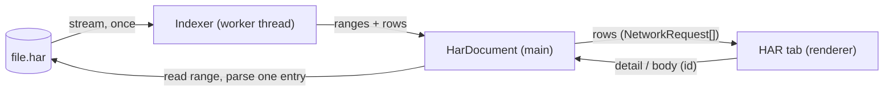

# Research: a HAR workbench to open, clean, compare and replay recorded requests

**Question.** A HAR file is how a bug report carries its network: a teammate, a customer or a CI run records what the page asked for and got. Today the app can write its Network panel as a HAR and turn a HAR's API responses into overrides, but it can't show you a HAR, tell you what's secret in it before you send it, or tell you what differs between two of them. Can it open, clean, compare and replay HAR files, including the big ones real sessions produce, and which tools should it build on?

**Status.** Researched, with the decisions made (§11) and a mockup of the proposal. Nothing here is built yet; §9 splits it into phases.

**Short answer.** Yes, with the parts the app already has. A HAR opens as an editor tab that reuses the Network panel's list and details, because a HAR entry carries the same request and response the live log shows. The file is indexed once, in a worker, by the byte range of each entry, so size stops mattering: the probe below indexed a 700 MB HAR in 10 s using about 170 MB of memory, where reading it whole fails at V8's 512 MB string limit. Bodies are then read from disk only when shown. Comparing two sessions lines up their requests in order (a sequence diff over method, URL and GraphQL operation) and diffs each pair's status, headers and body, with the noise (dates, trace ids, cache busters) ignored by rule. Cleaning redacts cookies, tokens and keys in place, keeping the JSON's shape so a cleaned HAR still replays and compares. Replay already works through overrides, and Playwright's `routeFromHAR` already accepts the app's exports.

Tools to build on (§5): **`@streamparser/json`** for indexing, jsdiff's **`diffArrays`** for lining up requests, **`jsondiffpatch`** (matching list items by `id`) for body diffs over the app's own lossless JSON parser, Monaco's **diff editor** for text, and **`@types/har-format`** for the types. Cleaning is the app's own redactor, with rules taken from Cloudflare's sanitizer and `har-sanitizer`, not either as is.

## 1. What the user does

| # | Story |
|---|---|
| H1 | I open a HAR (drop it on the window, **File › Open HAR…**, or from the Network panel) and browse it as I browse the live Network panel: filter by type, status and text, see a request's headers, payload and response, formatted |
| H2 | I search every URL, header and body in it for a value ("where did this id come from?") |
| H3 | I see at a glance what went wrong: failed and slow requests, the biggest responses, how many calls each endpoint got |
| H4 | Before I send a HAR, the app shows me every cookie, token, key and password in it, and saves a copy with them redacted, still valid JSON of the same shape |
| H5 | I compare two HARs (works on staging, broken on production; before and after a deploy; my session and a customer's) or a HAR and the live page: which requests appeared or went away, and for the rest what changed in status, headers, timing and body |
| H6 | I replay a HAR: the page gets its recorded answers, for the requests I pick, for as long as I want, without saving them as overrides; or I keep the ones I pick as overrides |
| H7 | I export the live log as a HAR that other tools read fully (timings, cookies, pages) and that's clean unless I ask otherwise, or I save a trimmed or edited copy of a HAR I opened |

## 2. What the app has today

Built in the Network panel's phase 3 ([NETWORK_PANEL.md](NETWORK_PANEL.md) §13, SPEC §6.10): **Export** writes the rows the list shows (`src/main/har/harOf.ts`), and **Import** turns every fetch/XHR entry with a text body into a response override that answers without sending (`overridesFromHar.ts`), up to 200, the last response to a request winning. Found by this research:

| Today | Gap |
|---|---|
| Export writes the headers as they went over the wire, cookies included: the probe's export carried `Cookie: sid=secret-session` in clear | Nothing warns or redacts. A HAR is sent to other people by design, and session cookies in support HARs have been used to take over accounts (§4) |
| `timings` is `{ send: 0, wait: <duration>, receive: 0 }`; `httpVersion` is always `HTTP/1.1`; `cookies` are empty; no `pages`, `pageref`, `serverIPAddress` or `_initiator` | Other tools show no waterfall or connection details for the app's HARs. `Network.responseReceived` already carries `timing`, `protocol`, `remoteIPAddress`, `encodedDataLength` and `requestWillBeSent` the `initiator`; the log just doesn't keep them |
| Import reads the whole file (`readFile` + `JSON.parse`) in the main process, up to 100 MB | Near that limit it blocks the main process, and so every window, for over a second (0.4 s at 25 MB, 1.9 s at 150 MB); past 512 MB it can't work at all (§3) |
| Import is all or nothing: every API response becomes a stored override | You can't look first, pick some, or replay without filling the workspace with overrides |
| There is no way to open a HAR to look at it, search it, or compare two | The core of this research |

## 3. Verified

Probed on 2026-09-25 with **Electron 44.4.5** (Node 24.21, V8 15.2, the runtime the app ships), **Chromium 141** (Playwright's) and the fixture site, with synthetic HARs shaped like a Chrome export of a busy single-page app (14 request and 12 response headers per entry, JSON bodies of 6 KB and some of 200 KB, one entry in ten a base64 PNG).

| Fact (verified) | Consequence |
|---|---|
| Reading a HAR whole: 25 MB in 0.4 s, 150 MB in 1.9 s (447 MB of heap after), 450 MB in 7.1 s (886 MB of heap). At 700 MB `readFile(…, 'utf8')` throws `RangeError: Invalid string length`: V8's longest string is 536,870,888 characters | Whole-file parsing can't be the plan: it blocks its thread for seconds and has a hard ceiling that real HARs (bodies included) reach |
| `@streamparser/json`, emitting each entry of `$.log.entries.*`: the same speed as `JSON.parse` (7.3 s for 450 MB), memory flat (180 MB at 450 MB, 184 MB at 700 MB), and the 700 MB file in 11 s. `stream-json` 3.7 did the same work 4 to 5 times slower (33 s for 450 MB) with 3 times the memory | `@streamparser/json` for anything read in a stream |
| Its tokenizer alone, tracking depth, records each entry's byte range in one pass: 150 MB in 2.0 s, 700 MB in 10 s, at 126 to 173 MB of memory. Reading one entry back by its range and parsing it takes 0.3 to 0.4 ms. Offsets are bytes: a pretty-printed HAR with `Ünïcödé 😀` in its bodies read back exactly | A HAR is indexed once and its entries read on demand from disk: memory stays flat whatever the file's size, and the renderer never holds bodies it isn't showing |
| Playwright's `recordHar` writes `pageref`, `pages` (with `pageTimings`), full `timings` (dns, connect, ssl, send, wait, receive), parsed `cookies`, `serverIPAddress`, and `_resourceType`, `_frameref`, `_monotonicTime`, `_serverPort`, `_securityDetails`, `response._transferSize`. An event stream's MIME type is `x-unknown` | These fields are what the app's export should add (§2). `_resourceType` is common to Chrome and Playwright; a HAR without it is typed from its MIME type, as import already does |
| The app's import of that Playwright HAR: 3 overrides from 7 entries (the cart, the worker's call, the GraphQL `GetUser`), the document, script and stream left out as intended | Import already reads other tools' HARs |
| Playwright's `routeFromHAR` given the app's export (with the cart's body edited in the file), limited to `**/network/api/**`: the page got the edited cart and the server saw no request | The app's HARs are usable as mocks in Playwright tests today; worth saying in the docs |
| Two recordings of the fixture page: the same 7 requests in the same order; matched by method, URL (query sorted) and GraphQL operation, only one `content-length` differed and no body did | Method + URL + operation is a sound key. The fixture is quieter than real sites, whose recordings differ in `date`, `age`, `etag`, trace ids (`x-request-id`, `traceparent`), cache-busting query values and cookie values: the diff needs ignore rules from the start (not measured here) |
| jsdiff's `diffArrays` over those keys keeps order and repeats (`GET /b` twice aligned as twice; `GetCart` shown as added between them) and aligned two 20,000-request sessions with 5 differences in 2 ms | Requests are lined up as a sequence diff, not by a map from key to entry, which would lose repeats and order. Myers' algorithm slows as the differences grow, so the alignment gets a time limit and falls back to pairing by key and occurrence (§6.3) |
| A list where item 2 was removed, item 4 added and item 1 renamed: `microdiff` reports 5 changes by position; `jsondiffpatch` told to match items by `id` reports exactly those 3. Without an `objectHash` it reports by position too | `jsondiffpatch` with an id-based `objectHash` for body diffs |
| `JSON.parse` turns `9007199254740993` and `9007199254740992` into the same number, and a diff of the parsed values reports no change | Body diffs run on the app's lossless parser (`src/shared/json`, which keeps numbers' text), with numbers handed to `jsondiffpatch` as their text |
| `har-sanitizer` 2.0 redacted `Authorization`, every cookie value, `access_token` and `code` in the query, and `password`, `email` and `refresh_token` in a JSON body. It left `X-Api-Key` as it was, replaced a whole `user` object with the string `"obfuscated"`, and rewrote `Set-Cookie` (adding `Path=/`) | Good rules to start from, but the app needs its own redactor: one that keeps shape and types, shows what it found before changing anything, and takes custom header names |
| `@types/har-format` 1.2.16 types HAR 1.2 with Chrome's `_initiator`, `_priority` and `_fromCache` (and many WebPageTest fields), but not `_resourceType` or `_webSocketMessages` | Use it, extended with the few fields the app reads and writes |

## 4. Other tools

Checked on 2026-09-25 in the tools' source code where it's public (Chrome DevTools, Firefox, WebKit, Playwright, Cloudflare's sanitizer, the HAR diff tools), otherwise in their documentation.

| Tool | Opens a HAR | Cleans | Compares | Worth taking |
|---|---|---|---|---|
| **Chrome DevTools** | **Import HAR file…** or a drop on the request table; clears the live log first | Since Chrome 130, export is sanitized by default: `Cookie`, `Authorization` and `Set-Cookie` headers and the `cookies` arrays are removed outright. **Allow to generate HAR with sensitive data** (Settings › Network) adds **Export HAR (with sensitive data)…** | No | Clean by default, with an explicit opt-in. Its fields (`_resourceType`, `_initiator`, `_priority`, `_fromCache`, `_transferSize`, `_webSocketMessages`, `_eventSourceMessages`) are what other tools expect |
| **Firefox DevTools** | **Import HAR File**, or a drop; replaces the list | No: cookies and headers written as they are | No | |
| **Safari Web Inspector** | Import button or a drop; each imported HAR is viewed apart from live traffic | No | No | Keeping an opened HAR apart from the live log, as a tab here does |
| **Google Admin Toolbox HAR Analyzer** | Upload | A button downloads a redacted copy (cookies, passwords, card numbers) | No | |
| **Cloudflare HAR Sanitizer** (har-sanitizer.pages.dev, archived 2026) | Upload, processed in the browser | Lists every cookie, header, query and post parameter name as a checkbox; a default list starts ticked (`Authorization`, `SAMLRequest`, `SAMLResponse`, `access_token`, `id_token`, `refresh_token`, `client_secret`, `code`, `code_verifier`, `password`, `email`, `state`, `token`, `x-client-data`…); a JWT keeps its header and claims, its signature redacted; script bodies can be dropped | No | Show every name found and let the user tick; its default list; redacting a JWT's signature only, so the token is unusable but its claims still explain the bug |
| **Proxyman** | A drop | | **Diff**: requests added to a diff pool, compared side by side (URL, method, status, headers, body) | A pair's side-by-side view |
| **Fiddler Everywhere / Classic** | Import snapshot / HTTPArchive | | Two selected sessions side by side (Classic hands them to WinDiff or WinMerge) | |
| **Charles, HTTP Toolkit, mitmproxy** | Yes (HTTP Toolkit and Charles import; mitmproxy reads with `-r`) | | No whole-session compare found | |
| **Playwright** | `routeFromHAR` serves a HAR's answers: exact URL string, method, and for POST a byte-equal body; among several matches the one with the most equal request headers, else the first. Unmatched requests are aborted by default (`notFound: 'abort'`) or go to the network (`'fallback'`). `recordHar` writes `content: 'embed'`, `'attach'` or `'omit'`, `mode: 'full'` or `'minimal'` (no sizes, timings, pages or cookies) | | | Interop (§3). A repeated request always gets the same entry there; ordered answers (§6.5) are a difference worth having |
| **HAR diff tools**: sitespeed.io compare, `harhar diff`, `waterfall-diff`, `har-compare` | Two files | | Match by full URL (sitespeed, query `version=` stripped), by flags you pick (harhar: URL, pathname, method, query, a header), by method + origin + path (waterfall-diff), or by URL substring (har-compare). None pairs by order, so repeated requests pair arbitrarily, and none diffs JSON bodies by item | The ignore-query and match-by-path options |
| **Postman, Insomnia, k6** (`har-to-k6`) | Import a HAR as a collection or a load-test script | | | Beyond this app's scope; **Copy as fetch** (and a later **Copy as cURL**) covers the one-request case |

**Why cleaning comes early.** Between 28 September and 17 October 2023, an attacker read files in Okta's support system; HAR files uploaded to support cases held session tokens, used to hijack sessions at five customers (Okta's root-cause report). 1Password, BeyondTrust and Cloudflare reported the attempts on them; Cloudflare released its sanitizer afterwards. Firefox and Safari still export everything, and this app's export does too (§2).

**What this means for the app.** Opening a HAR is table stakes: every browser does it. The app's edge is in what nothing else joins up: a HAR next to the live page, cleaned with a preview before it's sent, compared session to session in order with JSON bodies diffed by item, and replayed into the running page (not only into a test).

Sources: [Chrome 130 DevTools](https://developer.chrome.com/blog/new-in-devtools-130), [Chrome's HAR writer](https://github.com/ChromeDevTools/devtools-frontend/blob/main/front_end/models/har/Log.ts), [Firefox's HAR builder](https://github.com/mozilla-firefox/firefox/blob/main/devtools/client/netmonitor/src/har/har-builder.js), [Web Inspector's Network tab](https://webkit.org/web-inspector/network-tab/), [HAR Analyzer](https://support.google.com/a/answer/10985601), [Okta's root cause](https://sec.okta.com/articles/2023/11/unauthorized-access-oktas-support-case-management-system-root-cause/), [Cloudflare's account](https://blog.cloudflare.com/how-cloudflare-mitigated-yet-another-okta-compromise/), [Cloudflare's sanitizer](https://github.com/cloudflare/har-sanitizer), [Proxyman Diff](https://docs.proxyman.com/advanced-features/diff), [Fiddler Everywhere compare](https://docs.telerik.com/fiddler-everywhere/inspect-traffic/compare-traffic), [Playwright: mocking with HAR files](https://playwright.dev/docs/mock#mocking-with-har-files), [sitespeed.io compare](https://github.com/sitespeedio/compare), [harhar](https://github.com/bobvanderlinden/harhar), [waterfall-diff](https://github.com/meldyyt/waterfall-diff), [HAR 1.2 draft](https://w3c.github.io/web-performance/specs/HAR/Overview.html).

## 5. Tools to use

| Need | Use | Not | Why |
|---|---|---|---|
| Types | `@types/har-format` (+ `_resourceType`, `_webSocketMessages`) | the hand-written `HarEntry` | Complete, maintained with DefinitelyTyped, no runtime |
| Reading big files | `@streamparser/json` (MIT, no dependencies, Node and browser): its `Tokenizer` for the index, its `JSONParser` where values are wanted | `stream-json` (4 to 5 times slower here), whole-file `JSON.parse` above a few MB | §3 |
| Validating | the app's own per-entry checks, as import does now | `har-validator` (deprecated: "this library is no longer supported"), `har-schema` | Real HARs break the schema in small ways (Playwright's `x-unknown`, missing `pages`); a viewer should show what it can and say what it skipped |
| Lining up two sessions | jsdiff's `diffArrays` (BSD-3-Clause), with a time limit | a key → entry map | Keeps order and repeats (§3) |
| Diffing JSON bodies | `jsondiffpatch` (MIT) with an `objectHash` on `id`/`_id`/`uuid`/`key`, over the lossless parser | `microdiff`, `deep-diff` (deprecated) | Items matched by id, not position; 64-bit ids kept exact |
| Diffing text bodies and headers | Monaco's diff editor (already used for overrides), on bodies formatted by the existing formatter worker | jsdiff's text diff | Already in the app, with the same keys and theme as everywhere else |
| Redacting | the app's own rules (headers, cookie and query names, JSON keys, JWT and bearer patterns), edits made with the lossless parser | `har-sanitizer` as is | §3: it misses custom key headers and flattens objects. Its lists and Cloudflare's (§4) are a good starting set |
| Replay in tests | Playwright's `routeFromHAR` with the app's export | | §3: works today |

## 6. Proposal

### 6.1 A HAR is a tab

A HAR opens as an editor tab, like a file or a response: the editor area has the width a request list and its details need, several HARs can be open side by side, tabs come back after a restart, and a diff is a place tabs already know how to be. The bottom pane stays the live Network panel.

- **Opening:** **File › Open HAR…**, the Network panel's HAR menu (**Open a HAR…** next to Export and Import), the palette, and dropping a `.har` or `.json` on the window. A dropped file's path comes from `webUtils.getPathForFile` (Electron 29+), exposed by the preload: `File.path` was removed in Electron 32. Later, the `.har` file association in electron-builder.
- **The tab** is the Network panel's list and details over the file: the same columns, type chips, text filter and details (**Headers**, **Payload**, **Response**, **Messages** from `_webSocketMessages`), read-only. Above the list, a summary strip: requests, failed, total size, slowest, and the pages the HAR recorded (a page filter when it has several). **Search** looks through URLs, headers and bodies (in the worker, streaming from the ranges) and lists matches by request.
- **From an entry:** **Override response** opens its body in a response tab exactly as a live request's does (the method, operation and status filled in), **Copy URL** and **Copy as fetch** work as in the live panel (a **Copy as cURL** beside them would serve both).

The list and details today read the live log through `getNetworkRequest(id)`, `getNetworkResponseBody(id)` and `getNetworkMessages(id)`. A HAR document answers the same three with the same types, so the components take a request source instead of calling the live API directly, and nothing in them is HAR-specific.

### 6.2 Reading any size



- **Indexing** runs in a Node worker thread started by the main process: one pass with `@streamparser/json`'s tokenizer records each entry's byte range, and each entry is parsed once, on its own, to make its list row (method, URL, status, type, MIME, size, time, page, GraphQL operation, whether it has bodies). The main process stays free throughout; the tab shows progress.
- **`HarDocument`** (main) keeps the path, the file's size and modification time, the ranges and the rows. A detail or body is read from its range when asked for (0.3 ms) and decoded (`encoding: base64`). If the file changed on disk, it is indexed again.
- **Limits:** none from V8 strings; the list holds a row per entry (about 200 bytes each: 50,000 entries is 10 MB, sent once), virtualized as the live list is.
- **Saving** a trimmed, cleaned or edited copy (§6.4, §6.6) streams: each kept entry is either its byte range copied as is or its edited JSON, so saving never builds the whole file as one string either.

### 6.3 Comparing

**Compare with…** in a HAR tab picks the other side: another open HAR, a HAR file, or **the live log** (built into a `HarDocument` in memory from the log's rows, with the bodies the page still holds). The result is a tab of its own, both files named in its title.

- **Lining up.** Each entry's key is its method, scheme, host and path, its query with parameters sorted and the ignored ones left out, and the GraphQL operation (from the body, or the `operationName` query parameter of a GET). `diffArrays` over the two key sequences gives pairs in order, plus entries only on one side. It gets a time limit (jsdiff's `timeout`); past it, entries are paired by key and occurrence (the n-th `GET /b` with the n-th), which keeps pairs right and loses only where insertions sit.
- **A pair** compares its status, its headers (by name, case-folded, with ignored names left out), its sizes and time (as a difference and a ratio), and its bodies: JSON through the lossless parser and `jsondiffpatch` (items matched by `id`, `_id`, `uuid` or `key` when every item has one, by position otherwise), anything else as text.
- **The list** is the request list with one row per pair or lone entry and a mark: same, changed (with what changed: status, headers, body, slower, bigger), only in A, only in B. **Changed only** is on by default. **Details** show the two sides: a header table with the differing rows marked; the body as a list of changed paths (`data.items[id=4]` added, `data.user.name` changed) above Monaco's diff of the formatted bodies.
- **Ignore rules** (per workspace, editable from the compare tab): query parameters (defaults `_`, `t`, `ts`, `timestamp`, `cb`, `cachebust`), headers (defaults `date`, `age`, `expires`, `last-modified`, `etag`, `x-request-id`, `x-correlation-id`, `traceparent`, `tracestate`, `cf-ray`, `server-timing`, `report-to`, `nel`, and `authorization`, `cookie` and `set-cookie`, whose values differ in every session), and JSON paths (e.g. `*.updatedAt`, `meta.requestId`), added from a changed row's **Ignore** (a plain key becomes `*.key`, so `serverTime` is ignored wherever it is).
- **Redacted values aren't compared.** A value that reads `[redacted]` on either side (a cleaned HAR against a raw one) can't be told apart, so it counts as ignored, not changed.
- **Across hosts.** Comparing staging with production pairs nothing by default, since the host is part of the key; **Ignore host** leaves it out, as waterfall-diff's `--ignore-origin` does.

### 6.4 Cleaning

**Clean…** in a HAR tab (and before every export, §6.6) lists what it found before changing anything: each finding with where it is (entry, header, cookie, query parameter, body path), the rule that found it, and a switch; **Save cleaned copy…** writes the file.

- **Every name, as Cloudflare's sanitizer shows them:** the findings list starts with every cookie, header, query parameter, form parameter and JSON key the file has, grouped, so a secret under a name no rule knows can still be ticked.
- **Ticked by default:** headers `authorization`, `proxy-authorization`, `cookie`, `set-cookie`, `x-client-data`, and names matching `api-key`, `auth`, `token`, `secret`, `session`, `csrf`, `xsrf`; every cookie value; query parameters, form parameters and JSON keys matching `token` (`access_token`, `id_token`, `refresh_token`…), `secret`, `password`, `passwd`, `api_key`, `apikey`, `session`, `code`, `code_verifier`, `assertion`, `SAMLRequest`, `SAMLResponse`, `signature`, `sig`, `auth`; `Bearer …` values and JWTs (three base64url parts) wherever they are. Lists are editable, per workspace.
- **Redacting keeps shape.** A redacted value stays a string in the same place (`"[redacted]"`, or for a cookie `name=[redacted]` so its name survives), made as an edit through the lossless parser, so every other value, key order and number stay as recorded; objects are never replaced wholesale, and headers keep their names (Chrome removes them). A cleaned HAR still replays and still compares. A JWT keeps its header and claims and loses its signature, as Cloudflare's sanitizer does: the token stops working, its claims (expiry, scopes, user id) still explain the bug.
- **Consistent hashing** as an option: each value replaced by an HMAC of it under a key made for this save, so equal secrets stay equal inside the file (you can still see that two requests used the same session) without the value being recoverable.

### 6.5 Replaying

- **Serve from this HAR** (a switch in the tab): the page gets the HAR's recorded answers for the entries picked (by default its fetch/XHR entries, like import), for as long as the switch is on, without anything stored in the workspace. The engine serves them as overrides that live only in memory, beside the workspace's own (which win when both match); the status bar says a HAR is being served. Several responses to the same request are answered in order (the first call gets the first recorded answer, the next the next, then the last again), which replays polling and pagination as they happened; Playwright's `routeFromHAR` gives every repeat the same entry. Requests are matched as overrides match (URL, method, GraphQL operation), not by a byte-equal body as Playwright does, so a body with a new timestamp still gets its answer.
- **Keep as overrides…** is today's import, now from the entries picked in the tab, with the count and what's left out shown first.

### 6.6 Exporting and editing

- **Clean by default.** Export runs §6.4's rules and says what it redacted; **Include cookies and tokens** is off unless you turn it on for this export.
- **Fuller entries.** The log keeps what `Network.responseReceived` and `requestWillBeSent` already carry, so the export writes real `timings` (from `ResourceTiming`), `httpVersion` from `protocol`, `serverIPAddress`, parsed `cookies`, `_transferSize` (`encodedDataLength`), `_initiator`, and `pages` with each entry's `pageref` (the log already counts page loads).
- **Editing a HAR.** In a HAR tab: remove entries (the selection, or everything the filter hides), edit a response body (it opens in an editor tab, as an override's does), and **Save as…** a new file (§6.2's streaming write).

## 7. Code layout sketch

```
src/shared/har/          types (from @types/har-format, extended), entry key, ignore rules and defaults,
                         redaction rules (used by main to clean, and by the renderer to show findings)
src/main/har/            today's export and import, plus:
  HarDocument/           ranges, rows, detail(id), body(id), messages(id); re-index on change
  indexer/               the worker thread: tokenizer pass, rows
  compare/               key, align (diffArrays + fallback), pairDiff (status, headers, sizes, bodies)
  clean/                 findings, redact (lossless edits), hash
  writeHar.ts            streaming save of a trimmed, cleaned or edited copy
src/main/ipc/            registerHarIpc: open, close, detail, body, messages, search, compare, clean, save
src/renderer/src/
  entities/har-document/ open HARs (id, name, path, progress, rows)
  features/har/          open (menu, palette, drop), compare, clean, replay, save
  widgets/har-view/      the HAR tab: the network list and details over a HAR source, summary strip
  widgets/har-compare/   the compare tab
```

The request list and details move from `widgets/network-panel` to a shared place (an `entities/network-request` UI, or a `widgets/request-view` both panels compose), taking a request source.

## 8. Tests

- **Unit:** the indexer on files with multibyte text, pretty-printed and minified, a truncated file (an error naming the entry it stopped at), a file with no `log.entries`; keys (query order, ignored parameters, operations from body and query); alignment with repeats, insertions and the time-limit fallback; pair diffs (headers ignored, JSON by id, 64-bit ids); redaction keeping shape, custom names, JWTs in bodies, hashing consistency; streaming save round-tripping byte for byte when nothing changed.
- **Integration (Chromium):** a HAR recorded by Playwright and one exported by the app open, list and read the same as the live log did; replay answers in recorded order; the export's timings and cookies are present and parse.
- **End to end:** drop a HAR on the window and browse it; compare two HARs and see a changed body; clean and save, then reopen and find no cookie; serve from a HAR and see the page get its answer.

## 9. Phases

1. **Open and browse.** HAR tabs, indexing in a worker, the shared list and details over a request source, the summary strip, search, **Override response** from an entry. Replaces nothing that exists.
2. **Clean and export.** The redactor with its findings view, clean-by-default export, the fuller export entries, trimming and **Save as…**.
3. **Compare.** HAR with HAR and HAR with the live log, ignore rules, the compare tab.
4. **Replay.** **Serve from this HAR** with ordered answers, and import from picked entries.

## 10. Limits

- A HAR holds what the recorder kept: bodies the browser no longer held when it was exported, or left out on purpose (Playwright's `content: 'omit'`), can't be shown, compared or replayed, and the tab says so per entry; a `mode: 'minimal'` HAR has no timings or cookies to compare. A cleaned HAR (Chrome's default) has no cookies or `Authorization` headers to show.
- Replaying answers the page's requests; it can't replay what the page did (clicks, timers). The page must make the same requests for the recorded answers to be used.
- Compare lines up by request identity: a request whose URL carries a fresh id every time (`/orders/8421`) pairs only if its path segment is ignored or generalized (a later rule: `/orders/:id`).
- Redaction finds what its rules describe; a secret under an unusual name or in an unusual format survives unless a rule is added. The findings list is there to be read before sending.

## 11. Decisions

Made on 2026-09-25, as recommended:

1. **HARs open as editor tabs**, not as a source switch in the Network panel: room for the list and its details, several at once, restored on restart.
2. **Export is clean by default**; cookies and tokens go in only when turned on for that export.
3. **While replaying, a request the HAR doesn't hold goes to the network** (Playwright's `notFound: 'fallback'`).
4. **Redacted headers keep their names**, with a placeholder value, so replay and compare still see them.
5. **Phases in §9's order:** open and browse, clean and export, compare, replay.
