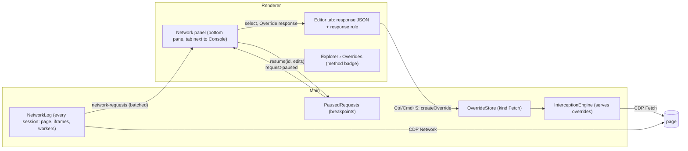

# Research: a Network panel to see, pause and edit requests

**Question.** A UI is often only as testable as the data behind it. Can the app show the page's requests, let you change a JSON response (an empty list, a very long name, a 500, a field the backend doesn't send yet) and see at once how the page renders it, with a real JSON editor and full control over the request and the response?

**Status.** All three phases (§8) are built: the Network tab, response overrides and the JSON editor; answering without sending the request, breakpoints and Copy as fetch; patch mode, quick edits, network speed, HAR export and import, and WebSocket messages; as SPEC §6.3, §6.10, §6.11 and §7 describe them. §11 to §13 list where the build differs from the plan below. Left for later: a tree view of a response with in-place edits (§5).

**Short answer.** Yes. The `Fetch` domain the app already drives for scripts and stylesheets answers `fetch()` and XHR the same way, and the probes below show everything a request panel needs: the paused request carries its method, headers and body; the response can take any status, headers and body; a request can wait for as long as you edit it; and the request itself can be changed before it goes out. Most of the work is in the UI and in a fourth override kind, not in new browser mechanics. The traps are CORS preflights, streams and the page's own timeouts; each has a rule below.

## 1. What the user does

| # | Story |
|---|---|
| N1 | I open **Network** next to the Console and see the page's requests (fetch/XHR by default, any type on demand) from the page, its iframes and its workers, each tagged with its frame as in the console |
| N2 | I select one and read its request (headers, query, body, pretty-printed) and response (status, headers, body as formatted JSON) |
| N3 | **Override response**: the body opens in an editor tab as formatted JSON. I edit it, set the status, headers or a delay, press Ctrl/Cmd+S, and from then on the page gets my version (after a reload, or on its next request) |
| N4 | The JSON editor validates, folds, formats, and offers the keys and types the live response has, so a typo or a wrong type shows before the page sees it |
| N5 | The override matches like a file override (exact, glob, regex), plus the method and, for GraphQL, the operation name, so one `/graphql` endpoint can carry many overrides |
| N6 | **Pause**: I set a breakpoint on a URL; the next matching request waits, its response opens for editing, and I send my version, the original, or a failure. At the request stage I can change the URL, method, headers or body before it goes out |
| N7 | **Don't send**: for a POST that would change data, the override answers without the request reaching the server |
| N8 | Overrides are per workspace, survive restarts, and can be turned off, diffed against the live response, and told apart from file overrides in the Explorer |

## 2. What Chromium does (probed)

Probed against real browsers with a fixture of same-origin and cross-origin JSON APIs, a GraphQL endpoint, an event stream and a dedicated worker: **Chromium 141.0.7390.37** (Playwright's) and **Electron 44.4.5 (Chromium 152.0.7977.130)**, the one the app ships. Results were the same in both except where noted. These facts should be pinned in `test/integration/network.chromium.test.ts` with the first engine change, as the iframe and worker facts are.

| Fact (verified) | Consequence |
|---|---|
| `fetch()` and XHR are both paused with `resourceType: 'XHR'` (the `Network` domain reports `Fetch` and `XHR`). A pattern with `resourceType: 'Fetch'` pauses nothing in 141; in 152 it pauses `fetch()`, still reported as `XHR` | Patterns for response overrides use `XHR`. `fetch()` and XHR are told apart, where it matters, by the `Network` event of the same `networkId` |
| An `EventSource` stream and CORS preflights are paused as `XHR` too. A preflight is paused at both stages with method `OPTIONS` (`Network` reports it as `Other`, then `Preflight`) | The resource type can't tell a JSON call from a stream or a preflight: overrides match the method, never answer `OPTIONS` unless asked to, and look at the response's `Content-Type` |
| A paused request carries its method, headers and body at both stages: `postData` (a 200 KB body in full), and `postDataEntries` for multipart | Method and body matching (GraphQL `operationName`) happen in the engine on the paused request, with no extra round trip |
| At the response stage, `Fetch.fulfillRequest` with any status, headers and body reaches the page as sent (the page saw `503`, a custom header and the new body). It also answers an upstream `404` and a refused connection (`responseErrorReason: 'Failed'`) | Status, error states and outages can be simulated, and an override works while the backend is down, as file overrides do (SPEC §6.3) |
| Cross-origin, at the response stage: keeping the upstream headers keeps CORS working; dropping `Access-Control-*` makes the page's fetch fail | Header edits are applied on top of the upstream headers, never instead of them |
| `Fetch.continueResponse` with a new status and headers keeps the upstream body (the page saw `418`, the new header, the original body) | A status- or headers-only override needs neither reading nor re-sending the body |
| At the request stage, `Fetch.fulfillRequest` answers without the server seeing anything, but CORS still applies: cross-origin without `Access-Control-Allow-Origin` fails, with it passes. The preflight is paused by the same patterns; continuing it to the server, or answering it (204, allowing the origin, method and headers it asks for), both let the real request through | A "don't send" override builds its CORS headers from the request's `Origin`, and answers or passes on the preflight for its URL |
| At the request stage, `Fetch.continueRequest` with new `postData` and `interceptResponse: true` sends the edited body (the server got `id: 999` instead of `7`) and pauses the response too | One breakpoint can edit the request, then the response |
| A paused request waits: held for 35 s, then fulfilled, the page got it. When the page gives up first (`AbortSignal.timeout(1000)`), `Network.loadingFailed` arrives with `canceled: true` (`net::ERR_ABORTED`) and later `Fetch` commands for it fail with `Invalid InterceptionId` | Breakpoints and delays are viable. A paused request the page abandoned is dropped from the UI on `loadingFailed`, not when its answer fails |
| An event stream paused at the response stage and continued unread works. `Fetch.getResponseBody` on it doesn't return while the stream is open, and the page then gets nothing even after it's continued; `Fetch.takeResponseBodyAsStream` with `IO.read` hung the same way | The response stage never reads the body of a `text/event-stream` (or other streaming) response. An override of a stream serves its body and ends it |
| A dedicated worker's `fetch()` is paused on the session of the frame that started it and reported (`Network`) on the worker's session | As with its scripts (SPEC §6.6): the frame's engine serves it, and the request log listens on worker sessions too |
| Without `Fetch`, `Network.getResponseBody` returned a 2.9 MB JSON body in full after `loadingFinished`; `requestWillBeSent` carried a 150 KB `postData`, and `Network.getRequestPostData` returned it | Listing requests pauses nothing and costs the page nothing; bodies are read on demand, from the buffers `Network.enable` already reserves (256 MB, SPEC §6.1) |

`navigator.sendBeacon` is reported as `Ping`, an image as `Image`; WebSocket messages are only reported (`Network.webSocketFrame*`), never paused, so they can be listed but not changed.

## 3. Three tools

- **Log** (see): every request with its headers and bodies. Pauses nothing.
- **Response override** (a rule): what the page gets whenever a request matches, until it's turned off. The same thing as a file override, for data: stored, per workspace, served on every match.
- **Breakpoint** (once, live): the next matching request waits for you. You edit and send it; nothing is kept unless you choose **Save as override**.

A response override replaces the whole body with the text you saved (a snapshot). That is predictable, works while the backend is down, and is what file overrides do. Its limit is that the rest of the response stops being live. A later **patch** mode (§8, phase 3) would store the edit as a JSON Patch between the base and your text (both are kept already, as for file overrides) and apply it to each live response, falling back to the snapshot when upstream fails.

## 4. The flow



**Network panel.** The bottom pane gets tabs, **Console** and **Network**, sharing its height and toggle (Ctrl/Cmd+J opens the last one shown; the palette has **Show Network**). A toolbar: text filter, type chips (Fetch/XHR on by default; Doc, JS, CSS, Img, Other), **Keep rows** as in the console, the breakpoints menu, clear. The list is virtualized like the console's: status, method, name (path and query), type, frame chip (the console's frame labels and colours), size, time, and a mark when an override answered it or it is paused. Selecting a row opens a detail pane beside the list: **Headers**, **Payload** (query and body, formatted), **Response** (read-only Monaco, formatted), with **Override response**, **Pause next like this**, **Copy as fetch** and, for a script, stylesheet or document, **Open file** (the existing `openResource`).

**Overriding a response.** **Override response** opens an unsaved editor tab, as opening a live file does (SPEC §7): the response body formatted, marked "Live response · not overridden". The header above the editor shows the match row (the existing `MatchRule`, defaulting to the exact URL ignoring the query) and a response row: method, the GraphQL operation when the body has one, status, headers (edits on top of upstream: set or remove), delay, and **Send request** (on: response stage, the default; off: the request never reaches the server). A non-GET override is created with **Send request** off and says why. Ctrl/Cmd+S creates the override; **Reload page on save** applies as for files, and without it the next matching request gets the new body. The Explorer lists these overrides with the file overrides, with a method badge and the status when it isn't 200.

**Breakpoints.** A rule is a URL matcher, a method and a stage (request or response). A paused request sorts to the top of the list, the Network tab and the status bar show a count, and its tab opens: at the response stage the body as above; at the request stage the URL, method, headers and body. **Send** (with your edits), **Send original**, **Fail** (an error reason, e.g. `ConnectionRefused`), **Save as override**. A request the page gave up on (fact: `loadingFailed` with `canceled`) is closed with a note, as is every paused request of a page that navigates.

## 5. The JSON editor

- **Language service.** Monaco 0.56 ships the JSON service (`monaco-editor/language/json/json.worker`); `shared/monaco/setup.ts` adds it to `LANGUAGE_WORKERS`. Validation, folding, formatting, bracket matching and breadcrumbs come with it. The language is picked from the response's `Content-Type` (JSON, `+json`, text, XML), not from the kind, so a text or XML response still gets a fitting mode.
- **Keys and types from the live response.** A JSON Schema inferred from the live response (and every other response of the same endpoint seen since) is registered for the tab's model (`jsonDefaults.setDiagnosticsOptions({ schemas: [{ uri, fileMatch: [model.uri.toString()], schema }] })`). Completion offers the keys the backend sends, hover shows their types, and a value of another type is a **warning**, not an error: sending a string where a number goes is a legitimate test.
- **Text is served as typed.** Formatting works on the text (js-beautify, in the existing format worker), never through `JSON.parse` and `JSON.stringify`, which would round 64-bit ids, keep only the last of duplicate keys and move integer-like keys to the front. Invalid JSON can be saved (a broken body is a test too), after a confirmation naming the first error.
- **Diff and drift.** The diff against the base and **Compare live** work as for files. "Upstream changed" can't use a byte hash here (API responses carry timestamps and ids), so a response override keeps the hash of the inferred schema instead: the warning means the live response's shape changed (a field added, removed or retyped).
- **Large bodies.** Over 1 M characters a body opens in lite mode as files do (highlighting only, no worker), with a Monarch JSON grammar registered next to the other lite grammars.
- **Later.** A tree view with in-place edits next to the text, and quick edits for UI states (empty every array, lengthen every string, null a field, fail with 500, add a delay).

## 6. Data model

A response override is an override of a fourth kind, `Fetch` (shown as "Fetch/XHR"), with two optional parts:

```ts
type ResourceKind = 'Document' | 'Script' | 'Stylesheet' | 'Fetch';

interface RequestMatch {                // Fetch overrides only; the URL is still `match`
  method: string;                       // 'GET', 'POST', … or '*'; never answers OPTIONS unless it says 'OPTIONS'
  body?: { type: 'graphql-operation' | 'contains' | 'regex'; pattern: string };
}

interface ResponseRule {                // Fetch overrides only
  status: number;                       // default: 200
  headers: { name: string; value: string | null }[];  // set (value) or remove (null), on top of upstream
  delayMs: number;                      // default: 0
  send: boolean;                        // false: answered at the request stage, the server never sees it
}

interface OverrideMeta {
  // …as today
  request?: RequestMatch;
  response?: ResponseRule;
}
```

Why not a separate entity: storage, workspaces, enabling, the hit counter, the Explorer, tabs with drafts and session restore, the diff base, the match row and the IPC surface all exist for overrides, and every `Record<ResourceKind, …>` (content type, file extension, language, formatter, labels and icons, about ten places) fails typecheck until it handles the new kind. The body goes in `files/<id>.json`.

Breakpoint rules are per workspace (`{ id, match: UrlMatcher, method, stage, enabled }`, beside the frame names in the session), so a debugging setup survives a restart; paused requests are never persisted.

## 7. Engine and main process

- **Request log.** `src/main/network/NetworkLog/`, built like `ConsoleService`: `PageInterception` hands it every session, workers included. Unlike the console it sends no commands to a worker (the engine already sends `Network.enable` there, SPEC §6.6), so it never delays a waiting worker; it only listens to `requestWillBeSent`, `responseReceived`, `loadingFinished` and `loadingFailed`, and the `ExtraInfo` events for the raw headers and cookies. Rows are keyed by session and request id, capped (2,000), and sent at most every 50 ms like console rows. Bodies are read on demand from the session that reported the request; one Chromium has evicted shows as "no longer available".
- **Serving.** `OverrideMatcher.find` also takes the method and the body. `answersKind` lets `XHR` (and `Fetch`, for Chromium versions that report it) be answered by a `Fetch` override first, then by script and style overrides as today. `PausedRequestHandler` gains the response rule: the status, header edits on top of `buildOverrideHeaders`, the delay, and at the request stage headers of its own (`Content-Type`, and CORS allowing the request's `Origin` with credentials, which suits both credentialed and plain requests) plus the answer to the preflight. It never reads the body of a streaming response.
- **Patterns.** `computeFetchPatterns` gives a `Fetch` override its URL pattern with `resourceType: 'XHR'`, at the response stage, or the request stage when it doesn't send. Enabled breakpoints add theirs. Everything else is unchanged, so a page with no response overrides and no breakpoints pauses exactly what it does today.
- **Breakpoints.** A `PausedRequests` registry keeps what is waiting (session, `requestId`, `networkId`), emits `request-paused`, and answers the renderer's `resumeRequest(id, action)`. It drops a request on its `loadingFailed`, on its session going away, and on a top-level navigation.
- **Existing gap, found by this research.** A file override with an `originalHash` reads the upstream body before serving (SPEC §6.3). If one ever matched an event stream, that read would never return and the request would hang. The stream rule above closes it for every kind.

## 8. Phases

1. **See and override.** The Network tab (fetch/XHR and every other type, with frame chips and details), `Fetch` overrides at the response stage (status, header edits, delay, method and GraphQL matching), the JSON service with the inferred schema, the Explorer entry. Pin §2's facts in an integration test; add JSON and GraphQL endpoints, an event stream and a worker `fetch()` to the fixture site; drive "override a response, see the page change" end to end.
2. **Full control.** Breakpoints at both stages, **Send request** off (request-stage answers with CORS and preflights), **Copy as fetch**, **Save as override** from a paused request.
3. **Depth.** Patch mode, quick edits for UI states, network throttling (`Network.emulateNetworkConditions` on every session), HAR export and import (a teammate reproduces a bug from your requests; ties in with M2's export), WebSocket messages (read-only).

## 9. Limits

- WebSocket messages can't be changed: CDP reports them but doesn't pause them.
- A streaming response (event stream, streamed `fetch`) can be replaced as a whole, which ends it, but not edited as it arrives.
- With the response stage (the default), the request still reaches the server: a POST still creates what it creates. That's why non-GET overrides start with **Send request** off.
- The page's own timeouts win: a breakpoint held longer than the page waits is abandoned, and the panel says so.
- Requests a service worker answers from its caches are never paused (SPEC §6.6, with **Bypass service workers** off).

## 10. Decisions

1. **The JSON is edited in editor tabs**, not inside the panel's detail pane: they have the width, the diff, drafts and the save flow already.
2. **An override serves a snapshot** by default (predictable, works while the backend is down); patch mode is a per-override option (**Patch live**, phase 3).
3. **Breakpoint rules are kept per workspace**, so a debugging setup survives a restart; paused requests never are.
4. **The log lists every type**, with Fetch/XHR selected by default; scripts, stylesheets and documents open in the editor from there.

## 11. Phase 1 as built

What differs from the plan above, and why:

- **Header changes are a header rule's** (`HeaderEdit`: `set` or `remove`, in order), not `{ name, value | null }`: validation, the headers the app refuses to change, applying them and the editor's rows are shared with header rules (`entities/rule` now holds the rows).
- **The request match is the method and the GraphQL operation** (`{ method, operation }`, '' for any body). `contains` and `regex` body matching wait for a need. Among overrides for the same URL, one naming a method or operation beats one that doesn't.
- **No `send` yet.** Every response override answered at the response stage, so the request still reached the server; phase 2 added **Send request** (§12).
- **No drift warning for responses.** A response override has no `originalHash`, and the hash of the inferred schema (§5, Diff and drift) isn't kept yet; the upstream body is never read before serving one.
- **The tab says "Live response"** until it is saved; the Explorer shows the method, and the status and delay when they aren't 200 and 0. A GraphQL override is named by its operation in tabs and the Explorer. **Compare live** is offered only for a GET: fetching the response again sends the request again.
- **An unsaved response tab** keeps its method, operation, status, delay and header changes, across a restart too (the session keeps them with the tab). Reopened after a restart, it comes back from its draft, or a GET is fetched again; any other is dropped rather than sent again.
- **Event streams.** An `EventSource`'s body is never read, even before its response comes (the panel says it's a stream, not that it's still arriving). An override that matches a stream replaces it as a whole, as §9 says; one that pauses it without answering continues it unread. Pinned in `test/integration/network.chromium.test.ts`, with §2's facts on listing (fetch, GraphQL, a failing call, a worker's fetch, page loads) and serving (body, status, header changes, delay, method and operation, a worker's fetch).
- **Page loads.** The log numbers each top-level page load from the main frame's first commit, so the first page's rows are load 0; the panel only compares loads.
- **A narrow panel** shows a request's details in place of the list (below 44rem), and the list drops its type, size and time columns while details are open.

## 12. Phase 2 as built

What differs from the plan above, and what the probes added:

- **Send request** is `ResponseSettings.send`; an override saved before it existed is sent. Off, the override's URL pauses at the request stage for `XHR` only, and it answers there with its status, body and header changes on a JSON response's own headers, plus CORS allowing the request's `Origin` with credentials. Its preflight (an OPTIONS asking for its method) gets a 204 allowing what it asked for, whatever GraphQL operation the override names: a preflight has no body to tell. Other methods, operations and preflights go on to the server, and a blocked request stays blocked. Pinned in `test/integration/held.chromium.test.ts`: another origin's POST and its preflight answered with the server never hit, and without the override the fixture API turning the preflight away.
- **`HeldRequests`, not `PausedRequests`**, in `src/main/network/`, one per page for every session. The renderer gets the whole list on every change (`held-requests`) rather than one event per request, which keeps a restarting renderer and a missed event from disagreeing. `resumeHeldRequest(id, action)` takes `continue`, `send` (request stage), `respond` (either stage: without sending it, or instead of its response) or `fail`, checked by `validateHeldAction` in both processes.
- **Let go of** when the page gives up on a request (`loadingFailed`), when its session's engine detaches, and when interception stops. A navigation cancels what is in flight, so it arrives as `loadingFailed` and needs no rule of its own.
- **A fact for the log:** a request-stage pause and `Network.requestWillBeSent` come in either order. Usually the row is listed first, but under load the pause can come first, so the log keeps a held mark for a row not listed yet and gives it to the row when it comes (pinned in the same test and in `test/unit/breakpoints.test.ts`).
- **Never stopped:** a CORS preflight, a redirect's response and an event stream (its body can't be read while it is open). Only the first enabled breakpoint that matches applies; up to 50 per workspace.
- **Not sorted to the top.** A strip above the list shows what is held (each opens its tab) instead of reordering the virtualized list under the reader; rows carry a pause mark, and the Network tab and status bar a count.
- **Pause like this** adds a response-stage breakpoint for the request's URL (exact, any query) and method, or turns an existing one back on. It stays until removed rather than stopping only the next request: the next one may not be the one you want.
- **Save as override** exists at the response stage only (before it is sent, the tab holds the request's body, not a response). The tab becomes the override's, and a non-GET override starts with **Send request** off, as one made from the panel does.
- **Closing a held tab** sends the request as it was, asking first if its body was edited; leaving it held with no tab would hang the page with nothing on screen to say why.
- **Copy as fetch** leaves out the headers the browser sets itself (`Cookie`, `Host`, `Origin`, `Sec-*`, `Content-Length`…), passes the `Referer` as `referrer`, and uses `credentials: 'include'` for the cookies. The body is the one the details pane shows (formatted when it is JSON).
- **Menus inside a popover** (the breakpoint form's match type, method and stage) closed it, since they draw outside it; a popover now counts its open menus as inside, and Esc in one closes the menu only.

## 13. Phase 3 as built

- **Patch mode is `ResponseSettings.patch`** (**Patch live** in the response row), not a JSON Patch stored on disk: the edits are worked out from the diff base and the content the store already keeps, once per version of the override, in the engine (`patchEdits`, a WeakMap by override object, shared by every session). The diff and the tree live in `src/shared/json`: a parser that keeps numbers' text (64-bit ids stay exact) and key order, so the patched body is written back compactly with every value the edit didn't touch as the server sent it. Objects are compared member by member; an array of the same length item by item, and one whose length changed is replaced whole, since items can't be told apart by position once some come or go (emptying a list keeps it empty; adding an item keeps your list). Only a sent request can be patched, so turning it on turns **Send request** on.
- **Falling back.** Upstream not 2xx: the saved text, quietly (the backend is down, as the plan said). The live body not JSON, the edits not fitting it, or the saved texts not JSON: the saved text, and `override-unpatched` says why once per version of the override. An event stream is never read.
- **Quick edits** are a menu in the response row rather than a separate toolbar: **Empty every list**, **Lengthen every text**, **Null the value at the cursor**, **Answer with 500**, **Answer after 3 s**. The text ones edit ranges found by the same parser, as one undoable edit, so the rest of the text stays as typed; **Lengthen every text** leaves links, ids, dates and emails alone, where a longer value would break the page's logic rather than show its layout.
- **Network speed is a setting** (`throttling`), not state of the panel: it is applied like the cache setting, to the page and every iframe and worker session (dedicated, shared and service workers; worklets have no network domain), and it survives a restart, so the status bar names it while it is on. Presets follow Chrome DevTools (Fast 4G, Slow 4G, 3G, Offline). `Network.emulateNetworkConditions` works in Chromium 141 and in Electron's 152 (pinned in `network.chromium.test.ts` and the end-to-end test). Settings are now checked key by key (`SETTING_CHECKS`), since this one isn't on or off.
- **HAR export** writes the rows the list shows (its filters apply), through a native save dialog, with the bodies Chromium still holds; a binary response body is left out. **HAR import** makes response overrides that answer without sending, in the workspace shown, from fetch() and XHR entries with a text body only: documents and scripts are file overrides' business, and a HAR's copy of them is rarely what a teammate meant to share. An exact URL keeps its query when it had one, so different queries answer differently; the last response to a request wins, at most 200 per import.
- **WebSockets** are rows of type `WebSocket` under a **WS** chip, with **Headers** and **Messages** in their details. The log keeps the latest 1,000 messages per socket, text cut at 64 K characters, and the panel reads only the ones that came since its last read. Messages are read-only, as §2 found.
