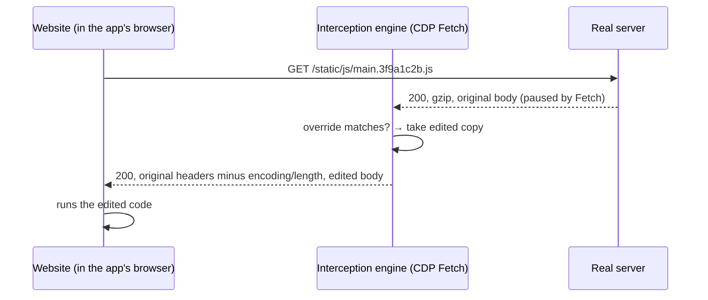

# Research: editing a live website's source files from a desktop app

**Question.** When a service is too big to build and run locally, can we still change its front-end code (JS, CSS, HTML) and try the change against the real, deployed site, using a proper editor instead of pasting code into the DevTools console?

**Short answer.** Yes. The idea is technically sound and has been proven in this repo against real Chromium. The browser mechanism it relies on is the same one Chrome DevTools uses for "Local Overrides", so the risk is low. The value of a dedicated app lies in the workflow around that mechanism, which existing tools each cover only in part.

---

## 1. How it works

A website's scripts and stylesheets reach the browser as ordinary network responses. The **Chrome DevTools Protocol (CDP)** lets a client that controls the browser pause any response (the `Fetch` domain), read it, and hand the page a different body. If we keep an edited copy of `main.3f9a1c2b.js` and give it to the page every time it asks for that URL, the page runs our code exactly as if the server had sent it.

Nothing changes on the server. Only the browser inside the app sees the edits. That makes it safe for debugging production, and it also means this is a debugging tool, not a way to deploy.

## 2. Verified in this repo

`test/integration/engine.chromium.test.ts` runs the engine against real Chromium and a fixture site built to reproduce what makes production sites hard. `test/e2e/app.e2e.test.ts` drives the actual desktop app. Everything below passes:

| Scenario | Result | What it took |
|---|---|---|
| Replace a gzip-compressed script | ✅ | The edited body is sent uncompressed; `Content-Encoding` and `Content-Length` must be dropped or the browser fails to decode it |
| Replace a script protected by **Subresource Integrity** (`<script integrity="sha384-…">`) | ✅ | Without help, the browser **refuses** the edited file (also tested). We strip `integrity` attributes from the HTML |
| Script whose `integrity` is set **at runtime** by a loader (webpack-subresource-integrity style) | ✅ | HTML stripping can't see it; a small guard script, injected before page scripts, neutralizes `integrity` on script/link tags |
| Cache-busted file names (`main.3f9a1c2b.js` → `main.9e8d7c6b.js` after a deploy) | ✅ | Glob match `main.*.js`; the app suggests the glob automatically |
| Replace a stylesheet | ✅ | |
| Replace the HTML document itself (to edit inline scripts) | ✅ | |
| Serve a file that is missing upstream (404) or while the server is down | ✅ | The override answers regardless of the upstream status (redirects are left alone) |
| Detect that the live file changed since the override was created | ✅ | Hash of the upstream body is compared on every load |
| Stale source maps | ✅ | `sourceMappingURL` comments and `SourceMap` headers are removed from edited files |
| Turn an override off | ✅ | The original file comes back on the next load |
| Edit files inside a **cross-site iframe** (its own process and CDP target) and a **nested** one | ✅ | Auto-attach to iframe targets, one engine per session, set up before the frame is allowed to run (details in [SPEC §6.5](./SPEC.md#65-iframes-cross-site-and-nested)) |
| Iframe HTML with SRI, runtime-set SRI inside an iframe, stylesheet and HTML overrides in iframes | ✅ | An iframe's document is served by its **parent's** session, its subresources by its own |
| A patched document that talks to local/intranet hosts | ✅ | A document served via CDP has no IP address, so Chromium's Local Network Access checks treat it as public and block its requests to private hosts. The app turns those checks off for its browser |
| Full app flow: open site → pick file → pretty-print → edit → Ctrl+S → page reloads with the edit → restart app → override still there | ✅ | |

Caching and service workers are handled by turning off the HTTP cache (`Network.setCacheDisabled`) and bypassing service workers (`Network.setBypassServiceWorker`) for the app's page, so an old copy can never sidestep an override.

## 3. Approaches compared

| Approach | How it serves the edited file | Editing experience | Friction / limits |
|---|---|---|---|
| **Chrome DevTools Local Overrides** (built into Chrome) | Same CDP interception, done by DevTools | DevTools Sources panel: basic editor, cramped | Only active while DevTools is open. Matches exact URLs, so a new build hash breaks the override. No SRI handling. Overrides are loose files in a folder, with no list of what's active |
| **Local MITM proxy** (mitmproxy, Charles "Map Local", Fiddler AutoResponder, Proxyman, HTTP Toolkit) | A proxy rewrites responses for every app on the machine | You edit files in your own editor, then map URLs to them by hand | Requires installing a **root CA certificate** (a security risk, and often blocked on company machines). No view of which files the page actually loaded |
| **Browser extension** (Requestly, Resource Override, …) | Manifest V3 `declarativeNetRequest` can *redirect* a URL but cannot rewrite a response body. Rewriting needs the `chrome.debugger` API, which shows a "started debugging this browser" bar | Editing happens in a popup or panel | MV3 limits. SRI and runtime SRI still apply |
| **Desktop app with its own Chromium (Electron) + CDP** ← *this project* | CDP `Fetch` on the embedded page | Monaco (VS Code's editor) with a list of the page's files, pretty-print, diff | Separate cookie jar: you log in once inside the app (sessions persist). ~100 MB app. A few SSO providers are wary of embedded browsers (mitigated by a standard Chrome user agent; see the external-Chrome mode below) |
| **Desktop app driving your own Chrome over CDP** (roadmap M3) | Same engine, over a WebSocket | Same | Since Chrome 136, `--remote-debugging-port` is ignored for the *default* profile, so this needs a dedicated Chrome profile (log in once there) |

The engine is written against a two-method CDP interface (`src/main/engine/cdp.ts`), so the embedded-browser mode (built) and the external-Chrome mode (planned) share all the interception logic.

**Try first:** if your need is occasional and DevTools Local Overrides is enough for it, use that. This app is for when you do this regularly, on minified bundles, across redeploys, or with SRI in the way.

## 4. Is the idea good?

**Yes.** Here is why, and where it stops.

Why it's worth building:
- **The foundation is proven.** DevTools itself relies on this interception mechanism, and every hard case we could think of is covered by a passing test.
- **The pain is real and the existing tools only cover parts of it.** DevTools has the mechanism with a poor editor. Proxies have your editor but need certificates and manual URL mapping. Extensions are hemmed in by MV3. Nothing combines a page-aware file list, a real editor, pretty-printing, diffing against the original, surviving redeploys, SRI handling and on/off switches in one loop of *edit → Ctrl+S → see it on the page*.
- **Low-risk to use.** Changes exist only in the app's browser, on your machine.

What to be clear about (limits):
1. **You edit the built output, not the original sources.** Bundled, minified JS is pretty-printed so it's readable, but variable names stay mangled. Source maps can show the original TS/JSX *read-only* (planned M4). Editing an original module and recompiling just that module is a research item, not a promise.
2. **Only the app's browser sees the change.** It's for debugging and trying fixes; the real fix still goes through your normal build and deploy.
3. **Workers** are separate CDP targets that aren't intercepted yet (M2). Iframes are, including cross-site and nested ones. One Chromium gap remains: when a cross-site iframe navigates back to its parent's site, that one document's files can't be intercepted; the app detects it and suggests a reload.
4. **Scripts that verify themselves** (anti-tamper checks, hash comparisons in code) may notice. That's rare outside ads and anti-bot scripts.
5. **Terms of use.** Changing what your own browser runs is fine for your own or your company's sites. Be thoughtful with third-party sites.

## 5. Decision

Build it as an Electron desktop app with an embedded Chromium view, a CDP `Fetch`-based interception engine, and a Monaco editor. Keep the engine transport-agnostic so the same code can later drive an external Chrome. The implementation plan is in [SPEC.md](./SPEC.md). Milestone M1 is built and tested in this repository.
