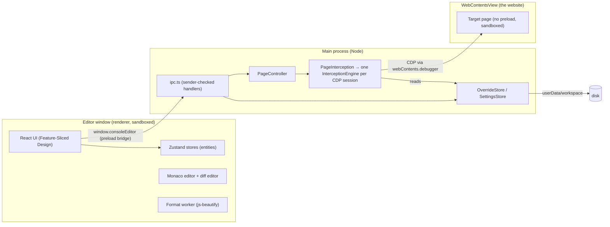

# Console Editor: product and implementation spec

Status legend: ✅ built and tested in M1 · 🔜 planned (milestone noted)

## 1. Goal

A desktop app where you enter a website's URL, see every script, stylesheet and HTML document the page loads, open any of them in a VS Code-grade editor, change it, and press Ctrl/Cmd+S. The page reloads running your version. No build, no server access, no certificates.

**Primary user:** a developer who needs to debug or try a fix on a deployed front end (staging or production) of a service too large to build and run locally.

**Non-goals:**
- Deploying changes. Edits live only in the app's browser.
- Editing original TypeScript/JSX sources and rebuilding (research item, §11).
- Being a general-purpose browser.

## 2. User stories

| # | Story | Status |
|---|---|---|
| U1 | I type a URL (or `localhost:3000`) and the site opens in the app | ✅ |
| U2 | I see the scripts, stylesheets and documents the page loaded, grouped by origin, and can filter them | ✅ |
| U3 | I click a file and it opens with syntax highlighting; minified files are pretty-printed first | ✅ |
| U4 | I edit and press Ctrl/Cmd+S; the page reloads and runs my version | ✅ |
| U5 | My overrides survive app restarts; I can turn each one on/off or delete it | ✅ |
| U6 | An override keeps working after a redeploy changes the file's build hash | ✅ (glob match + automatic suggestion) |
| U7 | I can diff my edits against the text I started from | ✅ |
| U8 | I'm told when the live file changed since I created the override, and can diff against the new live version | ✅ |
| U9 | SRI, gzip, caching and service workers don't silently defeat my edits | ✅ |
| U10 | I can open DevTools for the page to use the console, breakpoints and network panel | ✅ |
| U11 | I can edit override files in my own editor (VS Code) and the app picks up changes | 🔜 M2 |
| U12 | Overrides and file listing inside iframes, including cross-site (out-of-process) and nested ones | ✅ |
| U12b | Overrides for scripts loaded by workers | 🔜 M2 |
| U13 | Group overrides into named patch sets per site and export/import them to share with teammates | 🔜 M2 |
| U14 | Use my own Chrome (existing profile, extensions) instead of the embedded browser | 🔜 M3 |
| U15 | Browse original sources from source maps (read-only) and jump to the matching bundle code | 🔜 M4 |

## 3. Architecture



**Why these choices**
- **Electron.** Ships its own Chromium, so interception works the same on every machine and needs neither a certificate nor DevTools to be open. The embedded view is a `WebContentsView` placed next to the editor.
- **CDP `Fetch` domain at the *response* stage.** Keeps the real upstream headers (CORS, cookies, CSP) and lets us hash the upstream body to detect redeploys. The `Request` stage would skip the network but would have to invent headers.
- **Transport-agnostic engine.** `InterceptionEngine` talks only to `CdpTransport { send, on }`. There are adapters for Electron's debugger (app) and Playwright's CDP session (tests); an external-Chrome WebSocket adapter is M3.
- **Monaco.** It is VS Code's editor: syntax highlighting, find/replace, multi-cursor, minimap and a diff editor, running in-process with no language server needed.
- **React 19 + Zustand + Tailwind v4 + Motion.** The UI outgrew hand-written DOM code once it gained a command palette, context menus, virtualized trees and animated panels. Zustand keeps state outside React (the app event bridge writes to it without a component tree) and lets each component subscribe to exactly the slice it renders. The design system (tokens, motion rules, components) is in [`DESIGN_SYSTEM.md`](DESIGN_SYSTEM.md).
- **Feature-Sliced Design in the renderer.** Layers `app → pages → widgets → features → entities → shared`, each importing only from layers below it, checked by Steiger (`npm run lint:fsd`).

## 4. Source layout

```
src/
  shared/            types.ts (IPC + data model), matcher.ts (URL matching), minified.ts
  main/
    index.ts         app bootstrap: single-instance lock, window, session flush on close
    appInfo.ts       app id and repository URL (shared with electron-builder.ts)
    PageController.ts  WebContentsView for the site, navigation, engine wiring
    electronTransport.ts  webContents.debugger → CdpTransport
    engine/          PageInterception.ts (one engine per CDP session: page + iframes),
                     InterceptionEngine.ts, transform.ts (SRI/source maps/headers),
                     cdp.ts (transport interface), websocketTransport.ts (browser-level CDP, used by tests)
    store/           OverrideStore.ts, SettingsStore.ts, SessionStore.ts
    sitePermissions.ts  permission policy for the site view
    chromiumFlags.ts    Local Network Access switches (see §6.5, §8)
    ipc.ts, menu.ts
  preload/index.ts   contextBridge → window.consoleEditor
  renderer/src/      React UI, Feature-Sliced Design (see DESIGN_SYSTEM.md §6):
    app/             entry, providers, event bridge (main → stores), styles/tokens, component gallery
    pages/editor/    the workspace layout and its persisted layout store
    widgets/         title-bar, activity-bar, explorer, editor-panel, page-preview, status-bar, settings-panel, command-palette
    features/        open-resource, save-override, format-document, compare-changes, toggle/delete-override,
                     edit-match-rule, navigate-page, filter-resources, update-settings, close-tab
    entities/        page, settings, override, editor-tab (+ Monaco model registry), resource
    shared/          api (preload bridge), ui (design system), monaco, lib (format worker, overlays, motion), config
test/
  unit/              matcher, transform, store, engine and PageInterception (fake CDP), minified heuristic
  renderer/          resource tree building, palette fuzzy matching
  integration/       engine and iframe sessions against real Chromium + fixture site
  e2e/               the built Electron app driven by Playwright
  smoke/packaged.ts  a packaged build (installed app) driven over the remote debugging port
  fixtures/site.ts   fixture site: gzip, SRI (static + runtime), hashed names, source maps, iframes
  helpers/           Chromium launcher with the app's flags, WebSocket CDP harness
build/               icons, macOS entitlements (electron-builder's build resources)
electron-builder.ts  installer configuration
.github/workflows/   ci.yml (checks, tests), release.yml (installers on three systems, draft release)
```

## 5. Data model

```ts
type ResourceKind = 'Document' | 'Script' | 'Stylesheet';   // CDP resource types we override

interface UrlMatcher {
  type: 'exact' | 'glob' | 'regex';
  pattern: string;        // exact: full URL · glob: `*` = any run of chars · regex: JS RegExp
  ignoreQuery: boolean;   // compare without ?query / #hash (default true)
}

interface Override {
  id: string;             // 8 hex chars
  kind: ResourceKind;
  sourceUrl: string;      // URL the override was created from
  match: UrlMatcher;      // default: { exact, sourceUrl without query, ignoreQuery: true }
  enabled: boolean;
  originalHash: string | null;  // sha256 of the upstream body at creation → redeploy detection
  content: string;        // what gets served (kept in memory: the engine needs it on every request)
  createdAt: number; updatedAt: number;
}
// The diff base (what editing started from, after pretty-print) stays on disk until a diff asks for it.

interface SessionState {  // what the next start reopens
  url: string;            // last page shown
  tabs: { id: string; url: string; kind: ResourceKind; overrideId?: string; originalHash: string | null }[];
  activeTabId: string | null;
}
```

**Storage** (`<userData>/workspace/`, written atomically via temp file + rename, one write at a time):

```
overrides.json          { version: 1, overrides: OverrideMeta[] }   // metadata only
files/<id>.<js|css|html>        served content
files/<id>.base.<js|css|html>   diff base (only when it differs from the content)
settings.json (in <userData>)   Settings
session/session.json            SessionState
session/drafts/<tab>.txt        unsaved text of a tab
session/drafts/<tab>.base.txt   what that tab's editing started from (tabs not yet saved as overrides)
```

**Session restore.** The main process remembers the page URL on every main-frame navigation. The renderer writes the tab list 300 ms after it changes and a tab's draft 800 ms after typing pauses (the base once per tab); a draft is deleted when its tab is saved, undone back to the saved text, or closed. Closing the window runs a handshake: main sends `flush-session`, the renderer writes whatever is pending and answers `sessionFlushed(ok)`, and only then does the window close (after 5 s, or if a write failed, it asks before closing). On start, the app loads the last URL (a URL on the command line wins), then reopens each tab: an override from the store, a tab with a draft entirely from disk (no network), any other tab by fetching the file again; drafts are applied as one undoable edit, so the tab shows as unsaved and undo reveals the saved text. Tab ids are unique across runs because they name the drafts. Session syncing starts only after restoring, so a fresh start never overwrites the session being restored.

`CONSOLE_EDITOR_USER_DATA` overrides `<userData>` (used by tests; handy for throwaway profiles).

**Settings** (all booleans; defaults in brackets): reload page on save [on] · pretty-print minified files on open [on] · strip SRI [on] · strip source maps from overrides [on] · disable HTTP cache [on] · bypass service workers [on] · bypass CSP [off].

## 6. Interception engine

### 6.1 Attach
1. Load `about:blank` into the view first (renderer-side CDP commands never answer until a renderer exists).
2. `Page.enable`, `Page.getFrameTree` (remember the main frame id), `Network.enable` with large body buffers (256 MB total, 64 MB per resource) so `Network.getResponseBody` works for big bundles.
3. Apply settings: `Network.setCacheDisabled`, `Network.setBypassServiceWorker`, `Page.setBypassCSP`, and install/remove the runtime SRI guard (`Page.addScriptToEvaluateOnNewDocument`).
4. Compute `Fetch` patterns (§6.2) and `Fetch.enable` them, or `Fetch.disable` when there are none.
5. Navigation waits for attach to finish, so the first load is never missed.

### 6.2 Which requests get paused
Only requests that could need a change are paused (`requestStage: 'Response'`):
- each enabled **exact/glob** override → a precise CDP URL pattern (CDP wildcards `*`/`?` escaped in literal parts; trailing `*` when ignoring the query);
- each enabled **regex** override → `*` restricted to the override's resource type;
- if SRI stripping is on and any script/stylesheet override is enabled → every `Document`.

Patterns are recomputed whenever overrides are created, deleted, enabled/disabled or re-matched. Content-only saves don't touch patterns (content is read at request time).

### 6.3 On `Fetch.requestPaused`
1. Find the override for the URL: exact beats glob beats regex, then the most recently updated wins.
2. **Override found and the upstream response is not a redirect** (3xx + `Location`):
   - if the override has `originalHash` and upstream was 2xx: read the upstream body (`Fetch.getResponseBody`), decode it (base64 → bytes → `charset` from `Content-Type`, UTF-8 fallback), hash it, and emit `upstream-changed` if it differs;
   - body = override content; Documents get SRI stripped (if on); Scripts/Stylesheets get `sourceMappingURL` comments removed (if on);
   - headers = upstream headers **minus** `Content-Encoding`, `Content-Length`, `Transfer-Encoding`, digests, `ETag`, `Last-Modified`, `Cache-Control`/`Expires`/`Pragma` (and `SourceMap`/`X-SourceMap` when stripping), **plus** `Content-Type: <upstream type or default>; charset=utf-8` and `Cache-Control: no-store`;
   - `Fetch.fulfillRequest` with status **200**. This also answers 404/5xx/network errors, so you can patch files that are missing or while the server is down;
   - remember `networkId → overrideId` so the resource list can mark the file "served from override"; emit `override-served`.
3. **Document with SRI stripping on** (2xx HTML): read the body; if it has `integrity` attributes on `<script>`/`<link>`, fulfill with them removed (original status, headers minus body-specific ones).
4. Otherwise `Fetch.continueRequest`. Any error → emit `error` and continue the request, so a bug in the engine never hangs the page.

### 6.4 Runtime SRI guard
Injected before page scripts when SRI stripping is on. It makes the `integrity` property on `HTMLScriptElement`/`HTMLLinkElement` a no-op and drops `setAttribute('integrity', …)` on those elements. This covers loaders that set integrity on lazily created tags.

### 6.5 Iframes (cross-site and nested)

With site isolation, a cross-site iframe runs in its own renderer process and is a **separate CDP target**. `PageInterception` (`src/main/engine/PageInterception.ts`) runs one `InterceptionEngine` per CDP session: the page's own, plus one per iframe session, recursively. Each engine gets a session-bound transport (`sessionTransport()`), so a request paused on one session is always answered on that same session. Behaviour below was probed against real Chromium; the probes are encoded in `test/integration/iframes.chromium.test.ts`.

| Fact (verified) | Consequence |
|---|---|
| Same-site iframes live in the page's process | Handled by the page's engine; resources are labelled with `frame.depth ≥ 1` |
| A cross-site iframe's **document** is paused and reported on its **parent** session; its subresources on its **own** session | Document overrides and SRI stripping for iframe HTML happen in the parent's engine; the iframe's scripts/styles in its own |
| The iframe target attaches (`Target.attachedToTarget`, `waitingForDebugger: true`) after its document response, with an empty URL | Setup (Page/Network enable, settings, SRI guard, `Fetch.enable`, nested `setAutoAttach`) runs **before** `Runtime.runIfWaitingForDebugger`, so no subresource is missed |
| Cache-disable, service-worker bypass, CSP bypass and the SRI guard don't reach other targets | Applied per session, and re-applied to every live session when settings or overrides change |
| Commands in flight to a session that goes away **never settle** | Each child session tracks its in-flight commands and rejects them when it goes away (later sends fail at once); setup and fan-out have a 5 s timeout; the frame is always resumed in `finally` |
| No detach event is sent for grandchildren when a parent session goes away | Detach cascades through the recorded parent chain |
| Only the iframe's own session can return its document body | `getResourceContent` routes that read to the child session |
| Chromium reuses a target id when a frame gets a new session | Entries are scoped by **session** (`ResourceEntry.iframeId`), never by target id |
| An iframe navigating back to its parent's site loads that document's subresources on **no** session (a Chromium gap) | Detected: an enabled override whose file arrived unmodified emits `override-missed`; the UI offers a reload |
| A document served via `Fetch.fulfillRequest` has no IP address space, so Chromium's Local Network Access checks treat it as public and block its requests to loopback/intranet hosts | The app disables those checks for its browser (`src/main/chromiumFlags.ts`) |
| With the `RenderDocument` feature disabled (Playwright's Electron launcher does this), Electron 44 crashes (SIGSEGV) when a page with out-of-process iframe sessions reloads | `chromiumFlags.ts` keeps it enabled whatever else is passed in `--disable-features` |

Auto-attach uses `filter: [{type: 'iframe'}, {exclude: true}]` on every session; workers are excluded for now (M2).

**Events:** resources from cross-site iframes carry `iframeId`; `navigated` with an `iframeId` means that iframe loaded a new document (drop its entries), `iframe-detached` means the session went away (drop its entries and its descendants').

### 6.6 Resource list
- `Network.responseReceived` with type Document/Script/Stylesheet (not `data:`/`blob:`/internal URLs) → entry `{ url, kind, mimeType, status, overrideId?, frame?, iframeId? }`. `frame` (URL and depth) marks files loaded inside an iframe; an iframe's own document is labelled with its new URL.
- **Navigations reset the list when they commit, not when they start.** A main-frame document request (`requestId === loaderId`) only marks a navigation as pending. Until `Page.frameNavigated` commits it, late responses of the old page are not listed, and the new document's own response is held. On commit the list is cleared, `navigated` is emitted, then the held document is listed. A navigation that never commits (a download, a 204, a cancelled load: `Page.frameStoppedLoading` with nothing committed) leaves the list as it was. A commit without a request (back/forward cache, `about:blank`) resets the list too. Each iframe session applies the same rules to its own root frame and tags its `navigated` event with its `iframeId`.
- **Missed overrides:** an enabled override whose URL arrived without being served (it was enabled after the request, or an iframe loaded it on no session, §6.5) emits `override-missed` once per override and URL until the next navigation; the UI offers "Reload page".
- **Content for the editor:** for files served from an override, re-fetch upstream out-of-page (session cookies included) so the edited copy is never mistaken for the original. Otherwise try `Network.getResponseBody`, then `Page.getResourceContent`, then the out-of-page fetch. The result carries a sha256 hash (becomes `originalHash`).

## 7. Editor behaviour

| Action | Behaviour |
|---|---|
| Open a resource | If an override matches the URL, open the override instead. Otherwise fetch the live content, pretty-print it if it looks minified (longest line > 1000 chars or average > 150), and open it as an unsaved tab marked "Live file · not overridden" |
| Save (Ctrl/Cmd+S, or **Create override**) | New tab → `createOverride({ content, base, originalHash })`. Override tab → `updateOverride({ content })` when dirty. A save requested while one runs is queued once and sends the latest text when the first finishes. Then reload the page if that setting is on |
| Pretty-print (Shift+Alt+F) | js-beautify in a Web Worker; one undoable edit |
| Diff (Ctrl/Cmd+Shift+D) | Monaco diff: base (left, read-only) vs. current (right, editable) |
| Compare live | Fetch today's live file (pretty-printed if minified) and diff it against the override |
| Match row | Choose exact/glob/regex, edit the pattern, toggle ignore-query, Apply. Invalid regexes are rejected, and a pattern that no longer matches the source URL asks for confirmation |
| Build-hash hint | If the file name contains a build hash, offer a one-click glob (`main.3f9a1c2b.js` → `main.*.js`, `index-BkT3x9aQ.js` → `index-*.js`) |
| Explorer | Overrides (switch on/off, hit counter, ⚠ upstream changed, context menu) and page resources as a tree (origin → folders → files, served-from-override dot, iframe badge); a filter box covers both, including iframe URLs. The tree is virtualized and keyboard-navigable over all rows; resource events are applied once per animation frame (every 250 ms while the window is hidden), so pages with thousands of files stay smooth |
| Command palette (Ctrl/Cmd+K or P) | Fuzzy search over every page file, overrides and actions; the list refreshes while open as files arrive |
| Layout | Sidebar and preview are fitted to the window (the editor keeps at least 240 px; panel minimums give way below that, e.g. when zoomed in). Visibility and sizes are saved on every change |
| Large files | Scripts, stylesheets and HTML over 1 M characters open in a lite mode: syntax colouring only (Monarch grammars, no language service or validation, folding, minimap or bracket colourization), shown as "Large file" |
| Focus | Opening or switching tabs focuses the editor; closing a tab from the keyboard, typing in a field or arrowing through the Explorer never has focus pulled into the code |
| Close with unsaved edits | Closing a tab asks first. Closing the app keeps every unsaved edit as a draft and reopens it next time, with the tabs and the last page (see §5, Session restore) |
| Menu | App menu replaces Electron's default, so Ctrl/Cmd+R reloads **the site**, not the editor. Undo/redo/select-all are routed to Monaco. Page DevTools: Ctrl/Cmd+Shift+J; editor DevTools: Ctrl/Cmd+Alt+I. Ctrl/Cmd+B toggles the sidebar |

## 8. Security

- Editor window: `contextIsolation`, `sandbox`, a strict CSP (`script-src 'self'`), no navigation, no pop-ups. It sees only `window.consoleEditor`.
- Site view: no preload, sandboxed, separate persistent session partition (`persist:site`). It cannot reach IPC, and every IPC handler also checks that the sender is the editor window.
- Site permissions (`sitePermissions.ts`): Electron grants everything when a session has no handler, so the site session denies by default. Fullscreen, sanitized clipboard writes and pointer lock are granted; camera/microphone, location, notifications, clipboard reads, MIDI and launching other applications ask with a native dialog naming the requesting origin (remembered until quit; launching an app is asked every time); everything else is denied.
- Pop-ups: `window.open` pop-ups (sign-in flows need `window.opener`) open as child windows without interception; links meant for a new tab load in the page view, where overrides apply.
- A page's `beforeunload` guard cannot block reloads or navigation: editor-initiated reloads after a save must win, and Electron would cancel them without showing a dialog.
- **Trade-off:** Chromium's Local Network Access checks are disabled for the whole app (feature switches are process-wide), because documents served through `Fetch.fulfillRequest` have no address space and would otherwise be blocked from reaching localhost/intranet hosts (§6.5). Any page opened in the app can therefore reach local-network addresses, as in Chrome before these checks shipped. Browse only sites you are working on.
- Packaged builds flip Electron's fuses: `ELECTRON_RUN_AS_NODE`, `NODE_OPTIONS` and the `--inspect` switches are ignored, the app loads only from its `app.asar`, whose integrity is checked on macOS and Windows, and the site view's cookies are encrypted with the OS keystore. `file://` keeps its extra privileges because the editor UI and its module workers load from it.
- One instance per data folder (`app.requestSingleInstanceLock`), so two processes never write the same overrides and session files. A second launch hands its URL to the running window and exits.
- IPC inputs are type-checked; matchers are validated before storage; settings are filtered to known boolean keys.
- The site sees a standard Chrome user agent (Electron tokens removed).
- All data stays local: nothing is uploaded, and there are no telemetry or network calls besides the page and out-of-page fetches for the files you open.

## 9. Testing

| Layer | What | Command |
|---|---|---|
| Unit | Matchers, header/SRI/source-map transforms, stores (persistence, atomic concurrent writes), engine logic and navigation rules with a fake CDP transport, iframe session coordination (timeouts, sessions that go away, cascading detach), minified heuristic | `npm test` |
| Renderer | Resource tree building and filtering, command-palette fuzzy matching | `npm test` |
| Architecture | Feature-Sliced Design layer rules | `npm run lint:fsd` |
| Integration | Engine in real Chromium against the fixture site: gzip, static and runtime SRI, globs, CSS/HTML overrides, 404, redeploy detection, source maps, disable. Iframes through the session-aware WebSocket transport (`test/helpers/chromium.ts`): same-site, cross-site and nested iframes, SRI inside iframes, iframe HTML overrides, same-site navigation, removal, reload; each asserts the iframe really is a separate target | `npm test` (skips if no Chromium; `npx playwright install chromium`) |
| End-to-end | Built Electron app driven by Playwright: open site, edit, save, page runs it, disable/enable, edit files inside a cross-site and a nested iframe, persistence across restart, a second launch handing over its URL | `npm run test:e2e` (on headless Linux: `xvfb-run npm run test:e2e`) |
| Packaged | The installed app (asar, fuses, signature) fixes the demo store's checkout through the UI, driven over `--remote-debugging-port` since the fuses disable Node's inspector. The release workflow runs it on macOS (from the disk image), Windows (after a silent install) and Linux (from the installed `.deb`, with Ubuntu's user-namespace restriction left on) | `npm run test:packaged -- <app>` |

## 10. Packaging and releases

`electron-builder.ts` configures electron-builder; `npm run dist` builds the current system's installers into `dist/`. electron-vite bundles everything the app runs, dependencies included, into `out/`, so the package holds only `out/` and `package.json` (about 26 MB before Electron itself).

| System | Installers | Notes |
|---|---|---|
| macOS | `.dmg`, Apple silicon and Intel | Signed ad hoc unless a Developer ID certificate is configured (`CSC_LINK`/`CSC_NAME`): Apple silicon refuses unsigned code. Hardened runtime with JIT, camera, microphone and location entitlements (also for the helpers, where Chromium captures media) and the matching usage descriptions, without which macOS ends the app when a site asks. Not notarized, so Gatekeeper asks once on first launch |
| Windows | NSIS installer per architecture (x64, ARM64) | Per-user or per-machine; the app sets the same AppUserModelID as its shortcuts. Unsigned, so SmartScreen may warn |
| Linux | AppImage, `.deb`, `.rpm`, `.tar.gz`, x64 and arm64 | `desktopName` names the `.desktop` file and Electron's window class, so docks match the window to the launcher. The `.deb`/`.rpm` install an AppArmor profile, which Ubuntu 24.04+ requires for Chromium's sandbox |

`.github/workflows/release.yml` builds on macOS, Windows and Linux runners after the CI checks, installs each installer the way a user would, runs the packaged smoke test against the installed app, and drafts a GitHub release with `SHA256SUMS.txt`. It runs on a `vX.Y.Z` tag matching `package.json` or by hand (optionally drafting the release, whose tag is created on publishing). Signing, notarization and auto-update are not set up yet.

## 11. Milestones

**M1: MVP (done).** Everything marked ✅ above.

**M2: Robustness and sharing**
- ✅ Iframes, including cross-site and nested ones (§6.5).
- Workers: add `worker`/`service_worker` to the auto-attach filter, with an engine option that skips the Page domain.
- Watch `workspace/files` for external edits (edit in VS Code, the app reloads the page), with an "Open in external editor" action.
- Projects and patch sets per site; export/import as a zip or JSON, so a teammate can reproduce your fix.
- Response header overrides (CORS, CSP, cache) and request blocking (e.g. disable an analytics script).
- Search across all page resources (find which bundle defines a function).
- Docked/undocked page view, and responsive device presets.

**M3: Your own Chrome, and distribution**
- External Chrome mode: launch Chrome with a dedicated `--user-data-dir` plus `--remote-debugging-port`, or connect to a running one; `WebSocketTransport` implementing `CdpTransport`; one engine per tab.
- ✅ Installers with electron-builder, built and smoke-tested on all three systems by the release workflow (§10).
- Signed and notarized builds, plus auto-update.

**M4: Sources**
- Source-map explorer: list the original files from `sourcesContent`, open them read-only, and jump between an original line and the bundle line.
- Research: editing an original module and recompiling only it (esbuild transform) inside a webpack/Vite bundle's module map.
- Console panel inside the app (mirror of `Runtime.consoleAPICalled`), and quick snippets.

## 12. Risks and open questions

| Risk | Mitigation |
|---|---|
| SSO providers blocking embedded browsers | Standard Chrome user agent now; external-Chrome mode (M3) as the fallback |
| Huge bundles (10+ MB) are slow to pretty-print and highlight | The formatter runs in a worker that shuts down when idle; files over 1 M characters open in lite mode (no TypeScript service); file contents cross IPC once. Measured on a 2.7 MB bundle: opens in ~1.5 s; the editor window grows from ~190 MB to ~560–600 MB, of which only ~130 MB is JS heap (the rest is Monaco's native line/token buffers and rendering). A small file costs ~125 MB, mostly the TypeScript service, loaded on first use |
| Self-verifying scripts detect edits | Out of scope; document it |
| CDP behaviour changes between Chromium versions | Integration tests run the engine against real Chromium; pin and bump Electron deliberately |
| Minified identifiers make edits hard to write | Pretty-print now; source-map explorer (M4) |
