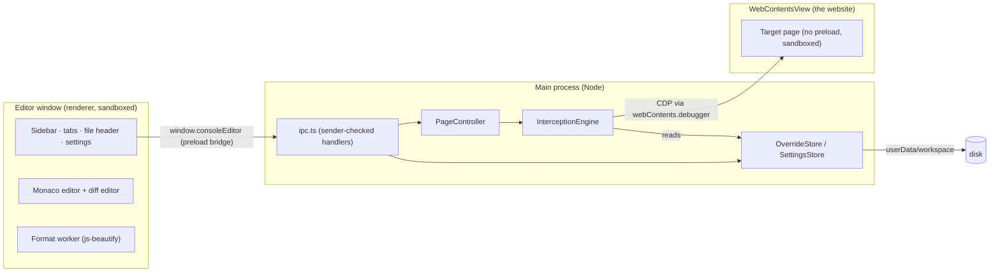

# Console Editor: product and implementation spec

Status legend: ✅ built and tested in M1 · 🔜 planned (milestone noted)

## 1. Goal

A desktop app where you enter a website's URL, see every script, stylesheet and HTML document the page loads, open any of them in a VS Code-grade editor, change it, and press Ctrl/Cmd+S. The page reloads running your version. No build, no server access, no certificates.

**Primary user:** a developer who needs to debug or try a fix on a deployed front end (staging or production) of a service too large to build and run locally.

**Non-goals:**
- Deploying changes. Edits live only in the app's browser.
- Editing original TypeScript/JSX sources and rebuilding (research item, §11).
- Being a general-purpose browser.

## 2. User stories

| # | Story | Status |
|---|---|---|
| U1 | I type a URL (or `localhost:3000`) and the site opens in the app | ✅ |
| U2 | I see the scripts, stylesheets and documents the page loaded, grouped by origin, and can filter them | ✅ |
| U3 | I click a file and it opens with syntax highlighting; minified files are pretty-printed first | ✅ |
| U4 | I edit and press Ctrl/Cmd+S; the page reloads and runs my version | ✅ |
| U5 | My overrides survive app restarts; I can turn each one on/off or delete it | ✅ |
| U6 | An override keeps working after a redeploy changes the file's build hash | ✅ (glob match + automatic suggestion) |
| U7 | I can diff my edits against the text I started from | ✅ |
| U8 | I'm told when the live file changed since I created the override, and can diff against the new live version | ✅ |
| U9 | SRI, gzip, caching and service workers don't silently defeat my edits | ✅ |
| U10 | I can open DevTools for the page to use the console, breakpoints and network panel | ✅ |
| U11 | I can edit override files in my own editor (VS Code) and the app picks up changes | 🔜 M2 |
| U12 | Overrides for scripts inside workers and cross-origin iframes | 🔜 M2 |
| U13 | Group overrides into named patch sets per site and export/import them to share with teammates | 🔜 M2 |
| U14 | Use my own Chrome (existing profile, extensions) instead of the embedded browser | 🔜 M3 |
| U15 | Browse original sources from source maps (read-only) and jump to the matching bundle code | 🔜 M4 |

## 3. Architecture



**Why these choices**
- **Electron.** Ships its own Chromium, so interception works the same on every machine and needs neither a certificate nor DevTools to be open. The embedded view is a `WebContentsView` placed next to the editor.
- **CDP `Fetch` domain at the *response* stage.** Keeps the real upstream headers (CORS, cookies, CSP) and lets us hash the upstream body to detect redeploys. The `Request` stage would skip the network but would have to invent headers.
- **Transport-agnostic engine.** `InterceptionEngine` talks only to `CdpTransport { send, on }`. There are adapters for Electron's debugger (app) and Playwright's CDP session (tests); an external-Chrome WebSocket adapter is M3.
- **Monaco.** It is VS Code's editor: syntax highlighting, find/replace, multi-cursor, minimap and a diff editor, running in-process with no language server needed.
- **No UI framework (yet).** The renderer is small (about 1,200 lines of TypeScript). If the UI grows past M2, moving to a framework such as Preact or Solid is cheap.

## 4. Source layout

```
src/
  shared/            types.ts (IPC + data model), matcher.ts (URL matching), minified.ts
  main/
    index.ts         app bootstrap, window, unsaved-changes prompt
    PageController.ts  WebContentsView for the site, navigation, engine wiring
    electronTransport.ts  webContents.debugger → CdpTransport
    engine/          InterceptionEngine.ts, transform.ts (SRI/source maps/headers), cdp.ts
    store/           OverrideStore.ts, SettingsStore.ts
    ipc.ts, menu.ts
  preload/index.ts   contextBridge → window.consoleEditor
  renderer/          index.html, src/main.ts (App), editorPane.ts, sidebar.ts, monaco.ts, format*.ts, styles.css
test/
  unit/              matcher, transform, store, engine (fake CDP), minified heuristic
  integration/       engine against real Chromium + fixture site
  e2e/               the built Electron app driven by Playwright
  fixtures/site.ts   fixture site: gzip, SRI (static + runtime), hashed names, source maps
```

## 5. Data model

```ts
type ResourceKind = 'Document' | 'Script' | 'Stylesheet';   // CDP resource types we override

interface UrlMatcher {
  type: 'exact' | 'glob' | 'regex';
  pattern: string;        // exact: full URL · glob: `*` = any run of chars · regex: JS RegExp
  ignoreQuery: boolean;   // compare without ?query / #hash (default true)
}

interface Override {
  id: string;             // 8 hex chars
  kind: ResourceKind;
  sourceUrl: string;      // URL the override was created from
  match: UrlMatcher;      // default: { exact, sourceUrl without query, ignoreQuery: true }
  enabled: boolean;
  originalHash: string | null;  // sha256 of the upstream body at creation → redeploy detection
  content: string;        // what gets served
  base: string;           // what editing started from (after pretty-print) → diff view
  createdAt: number; updatedAt: number;
}
```

**Storage** (`<userData>/workspace/`, written atomically via temp file + rename, one write at a time):

```
overrides.json          { version: 1, overrides: OverrideMeta[] }   // metadata only
files/<id>.<js|css|html>        served content
files/<id>.base.<js|css|html>   diff base
settings.json (in <userData>)   Settings
```

`CONSOLE_EDITOR_USER_DATA` overrides `<userData>` (used by tests; handy for throwaway profiles).

**Settings** (all booleans; defaults in brackets): reload page on save [on] · pretty-print minified files on open [on] · strip SRI [on] · strip source maps from overrides [on] · disable HTTP cache [on] · bypass service workers [on] · bypass CSP [off].

## 6. Interception engine

### 6.1 Attach
1. Load `about:blank` into the view first (renderer-side CDP commands never answer until a renderer exists).
2. `Page.enable`, `Page.getFrameTree` (remember the main frame id), `Network.enable` with large body buffers (256 MB total, 64 MB per resource) so `Network.getResponseBody` works for big bundles.
3. Apply settings: `Network.setCacheDisabled`, `Network.setBypassServiceWorker`, `Page.setBypassCSP`, and install/remove the runtime SRI guard (`Page.addScriptToEvaluateOnNewDocument`).
4. Compute `Fetch` patterns (§6.2) and `Fetch.enable` them, or `Fetch.disable` when there are none.
5. Navigation waits for attach to finish, so the first load is never missed.

### 6.2 Which requests get paused
Only requests that could need a change are paused (`requestStage: 'Response'`):
- each enabled **exact/glob** override → a precise CDP URL pattern (CDP wildcards `*`/`?` escaped in literal parts; trailing `*` when ignoring the query);
- each enabled **regex** override → `*` restricted to the override's resource type;
- if SRI stripping is on and any script/stylesheet override is enabled → every `Document`.

Patterns are recomputed whenever overrides are created, deleted, enabled/disabled or re-matched. Content-only saves don't touch patterns (content is read at request time).

### 6.3 On `Fetch.requestPaused`
1. Find the override for the URL: exact beats glob beats regex, then the most recently updated wins.
2. **Override found and the upstream response is not a redirect** (3xx + `Location`):
   - if the override has `originalHash` and upstream was 2xx: read the upstream body (`Fetch.getResponseBody`), decode it (base64 → bytes → `charset` from `Content-Type`, UTF-8 fallback), hash it, and emit `upstream-changed` if it differs;
   - body = override content; Documents get SRI stripped (if on); Scripts/Stylesheets get `sourceMappingURL` comments removed (if on);
   - headers = upstream headers **minus** `Content-Encoding`, `Content-Length`, `Transfer-Encoding`, digests, `ETag`, `Last-Modified`, `Cache-Control`/`Expires`/`Pragma` (and `SourceMap`/`X-SourceMap` when stripping), **plus** `Content-Type: <upstream type or default>; charset=utf-8` and `Cache-Control: no-store`;
   - `Fetch.fulfillRequest` with status **200**. This also answers 404/5xx/network errors, so you can patch files that are missing or while the server is down;
   - remember `networkId → overrideId` so the resource list can mark the file "served from override"; emit `override-served`.
3. **Document with SRI stripping on** (2xx HTML): read the body; if it has `integrity` attributes on `<script>`/`<link>`, fulfill with them removed (original status, headers minus body-specific ones).
4. Otherwise `Fetch.continueRequest`. Any error → emit `error` and continue the request, so a bug in the engine never hangs the page.

### 6.4 Runtime SRI guard
Injected before page scripts when SRI stripping is on. It makes the `integrity` property on `HTMLScriptElement`/`HTMLLinkElement` a no-op and drops `setAttribute('integrity', …)` on those elements. This covers loaders that set integrity on lazily created tags.

### 6.5 Resource list
- `Network.responseReceived` with type Document/Script/Stylesheet (not `data:`/`blob:`/internal URLs) → entry `{ url, kind, mimeType, status, overrideId? }`.
- `Network.requestWillBeSent` for a main-frame document (`requestId === loaderId`) → clear the list and emit `navigated`.
- **Content for the editor:** for files served from an override, re-fetch upstream out-of-page (session cookies included) so the edited copy is never mistaken for the original. Otherwise try `Network.getResponseBody`, then `Page.getResourceContent`, then the out-of-page fetch. The result carries a sha256 hash (becomes `originalHash`).

## 7. Editor behaviour

| Action | Behaviour |
|---|---|
| Open a resource | If an override matches the URL, open the override instead. Otherwise fetch the live content, pretty-print it if it looks minified (longest line > 1000 chars or average > 150), and open it as an unsaved tab marked "Live file · not overridden" |
| Save (Ctrl/Cmd+S, or **Create override**) | New tab → `createOverride({ content, base, originalHash })`. Override tab → `updateOverride({ content })` when dirty. Concurrent saves are coalesced. Then reload the page if that setting is on |
| Pretty-print (Shift+Alt+F) | js-beautify in a Web Worker; one undoable edit |
| Diff (Ctrl/Cmd+Shift+D) | Monaco diff: base (left, read-only) vs. current (right, editable) |
| Compare live | Fetch today's live file (pretty-printed if minified) and diff it against the override |
| Match row | Choose exact/glob/regex, edit the pattern, toggle ignore-query, Apply. Invalid regexes are rejected, and a pattern that no longer matches the source URL asks for confirmation |
| Build-hash hint | If the file name contains a build hash, offer a one-click glob (`main.3f9a1c2b.js` → `main.*.js`, `index-BkT3x9aQ.js` → `index-*.js`) |
| Sidebar | Overrides (checkbox on/off, hit counter, ⚠ upstream changed, delete) and page resources grouped by origin (green = served from override); a filter box covers both |
| Close with unsaved edits | Tab close confirms. App close shows a native "Discard changes?" dialog |
| Menu | App menu replaces Electron's default, so Ctrl/Cmd+R reloads **the site**, not the editor. Undo/redo/select-all are routed to Monaco. Page DevTools: Ctrl/Cmd+Shift+J |

## 8. Security

- Editor window: `contextIsolation`, `sandbox`, a strict CSP (`script-src 'self'`), no navigation, no pop-ups. It sees only `window.consoleEditor`.
- Site view: no preload, sandboxed, separate persistent session partition (`persist:site`). It cannot reach IPC, and every IPC handler also checks that the sender is the editor window.
- IPC inputs are type-checked; matchers are validated before storage; settings are filtered to known boolean keys.
- The site sees a standard Chrome user agent (Electron tokens removed).
- All data stays local: nothing is uploaded, and there are no telemetry or network calls besides the page and out-of-page fetches for the files you open.

## 9. Testing

| Layer | What | Command |
|---|---|---|
| Unit | Matchers, header/SRI/source-map transforms, stores (persistence, atomic concurrent writes), engine logic with a fake CDP transport, minified heuristic | `npm test` |
| Integration | Engine in real Chromium (Playwright CDP session) against the fixture site: gzip, static and runtime SRI, globs, CSS/HTML overrides, 404, redeploy detection, source maps, disable | `npm test` (skips if no Chromium; `npx playwright install chromium`) |
| End-to-end | Built Electron app driven by Playwright: open site, edit, save, page runs it, disable/enable, persistence across restart | `npm run test:e2e` (on headless Linux: `xvfb-run npm run test:e2e`) |

## 10. Milestones

**M1: MVP (done).** Everything marked ✅ above.

**M2: Robustness and sharing**
- Auto-attach to workers and out-of-process iframes (`Target.setAutoAttach { flatten: true }`, reuse the engine per session via `sessionId`).
- Watch `workspace/files` for external edits (edit in VS Code, the app reloads the page), with an "Open in external editor" action.
- Projects and patch sets per site; export/import as a zip or JSON, so a teammate can reproduce your fix.
- Response header overrides (CORS, CSP, cache) and request blocking (e.g. disable an analytics script).
- Search across all page resources (find which bundle defines a function).
- Docked/undocked page view, and responsive device presets.

**M3: Your own Chrome, and distribution**
- External Chrome mode: launch Chrome with a dedicated `--user-data-dir` plus `--remote-debugging-port`, or connect to a running one; `WebSocketTransport` implementing `CdpTransport`; one engine per tab.
- Packaging with electron-builder (macOS dmg with notarization, Windows NSIS, Linux AppImage), plus auto-update.

**M4: Sources**
- Source-map explorer: list the original files from `sourcesContent`, open them read-only, and jump between an original line and the bundle line.
- Research: editing an original module and recompiling only it (esbuild transform) inside a webpack/Vite bundle's module map.
- Console panel inside the app (mirror of `Runtime.consoleAPICalled`), and quick snippets.

## 11. Risks and open questions

| Risk | Mitigation |
|---|---|
| SSO providers blocking embedded browsers | Standard Chrome user agent now; external-Chrome mode (M3) as the fallback |
| Huge bundles (10+ MB) are slow to pretty-print and highlight | The formatter runs in a worker; Monaco's large-file optimizations apply; consider a faster formatter if needed |
| Self-verifying scripts detect edits | Out of scope; document it |
| CDP behaviour changes between Chromium versions | Integration tests run the engine against real Chromium; pin and bump Electron deliberately |
| Minified identifiers make edits hard to write | Pretty-print now; source-map explorer (M4) |
